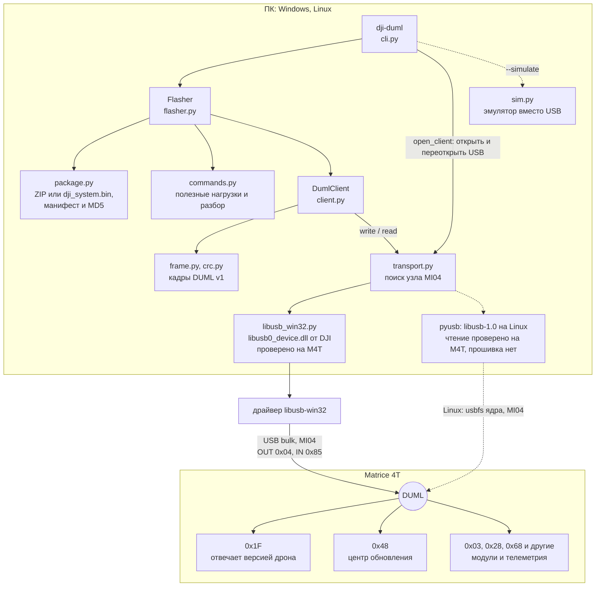
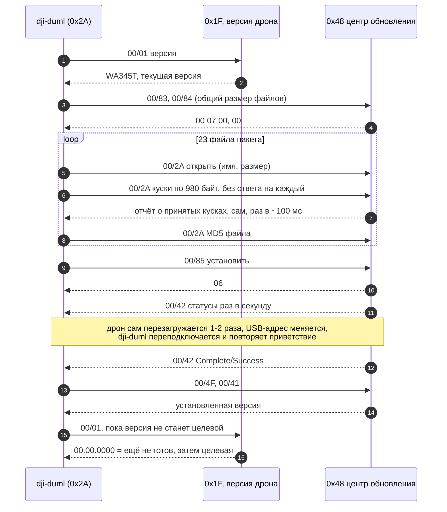

# dji_duml — прошивка DJI Matrice 4T по USB без DJI Assistant

Python-пакет и CLI `dji-duml`, которые говорят с дроном протоколом DJI DUML
напрямую по USB: читают версию, разбирают пакеты прошивки и USB-захваты,
достают из захватов переданную прошивку и прошивают Matrice 4T тем же
способом, что и DJI Assistant 2, но без его окна.

**Статус (2026-10-05): прошивка M4T проверена на железе.** Пять прошивок на
трёх дронах прошли успешно. Четыре из официального офлайн-ZIP
`M4T_UAV_17.02.05.01_pro.zip`, одна — откат на 14.01.0012 из пакета, который
`dji-duml pack` собрал из USB-захвата онлайн-прошивки Assistant:

| Дрон | Прогон | Пакет | Перезагрузки | Время | Итог |
|---|---|---|---|---|---|
| 1 | Refresh 17.02.0501 → 17.02.0501 | ZIP | 1 | 205 с | Complete/Success, версия 17.02.0501 |
| 1 | 17.01.0516 → 17.02.0501 | ZIP | 2 | 357 с | Complete/Success, версия 17.02.0501 |
| 2 | 17.01.0516 → 17.02.0501 | ZIP | 2 | 358 с | Complete/Success, версия 17.02.0501 |
| 3 | 17.01.0516 → 14.01.0012 (откат) | `pack` из захвата | 2 | 442 с | Complete/Success, версия 14.01.0012 |
| 3 | 14.01.0012 → 17.02.0501 | ZIP | 2 | 449 с | Complete/Success, версия 17.02.0501 |

Процедура повторяет DJI Assistant байт в байт: все 679 445 полезных нагрузок
передачи файлов и все управляющие команды совпадают с USB-захватом
Assistant, а со стороны дрона наш прогон неотличим от его прогона. Онлайн-
откат Assistant 17.01.0516 → 14.01.0012 и возврат на 17.01.0516
(2026-10-05) идут той же процедурой: отдельного шага для отката нет.

**Извлечение прошивки из USB-захвата проверено на шести захватах.**
`dji-duml extract` собрал из каждого все переданные файлы, и все прошли
проверки; итог сверен с независимыми источниками:

| Захват | Файлов | Сверено с |
|---|---|---|
| Assistant, офлайн-ZIP → 17.02.0501 | 23 | ZIP: байт в байт |
| dji-duml, Refresh 17.02.0501 | 23 | ZIP: байт в байт |
| dji-duml, 17.01.0516 → 17.02.0501 | 23 | ZIP: байт в байт |
| Assistant, онлайн-Refresh 17.01.0516 | 23 | манифест, независимая сборка: байт в байт |
| Assistant, онлайн-откат 17.01.0516 → 14.01.0012 | 17 | манифест, кэш Assistant: 16 модулей байт в байт |
| Assistant, онлайн 14.01.0012 → 17.01.0516 | 23 | манифест, онлайн-Refresh днём раньше и кэш Assistant: байт в байт |

В обоих онлайн-прогонах 2026-10-05 сумма размеров файлов ровно равна общему
размеру, который Assistant объявил дрону (`00/84`). `.cfg.sig` в кэше
Assistant нет; её подтверждают MD5 из кадра завершения и сошедшийся по ней
манифест.

> Прошивка — операция с риском для устройства. Используйте только
> официальные пакеты DJI для своей модели; подпись DJI проверяет сам дрон.
> Проверено на трёх M4T и двух версиях: 17.02.0501 (офлайн-ZIP) и 14.01.0012
> (пакет из `pack`); на других моделях и версиях — нет.

## Содержание

- [Требования](#требования) · [Установка](#установка) · [Linux](#linux)
- [Быстрый старт](#быстрый-старт)
- [Хранилище прошивок (`dji-duml fw`)](#хранилище-прошивок-dji-duml-fw)
- [CLI](#cli): [общие ключи](#общие-ключи) · [команды](#команды) · [ключи `flash`](#ключи-flash) · [коды выхода `flash`](#коды-выхода-flash) · [ключи `decode`](#ключи-decode)
- [Что можно прочитать с дрона](#что-можно-прочитать-с-дрона): [`version`](#версия-version) · [`manifest`](#манифест-установленной-прошивки-manifest) · [`params`](#параметры-полётного-контроллера-params) · [`set-param`](#запись-параметра-set-param)
- [Справка по параметрам полётного контроллера](#справка-по-параметрам-полётного-контроллера)
- [Как это работает](#как-это-работает)
- [Документация](#документация)
- [Устройство пакета](#устройство-пакета) · [Тесты](#тесты) · [Ограничения](#ограничения)

## Требования

- Windows с установленным DJI Assistant 2 (Enterprise Series): нужен его
  драйвер libusb-win32. Драйверы менять не надо. Или Linux с libusb-1.0 —
  см. [Linux](#linux); macOS не проверялся.
- Python 3.10+ и `pyusb`.
- DJI Assistant и его службы `DJIService` / `DJIServiceCore` закрыты: USB-
  интерфейс DUML может держать только одна программа.

## Установка

```powershell
git clone <url> m_flasher-dji_duml
cd m_flasher-dji_duml
py -m pip install -e ".[usb]"
dji-duml --help
```

Без установки CLI запускается из папки проекта: `py -m dji_duml --help`
(нужен только `py -m pip install pyusb`).

## Linux

На Linux `dji-duml` работает через обычную libusb-1.0 из дистрибутива: ни
DJI Assistant, ни его драйвер не нужны. Проверено 2026-10-05 на Gentoo
(OpenRC, Python 3.14, libusb-1.0) с M4T на 16.01.0006: `scan`, `version`,
`manifest` и `params` дали те же ответы, что на Windows (манифест байт в
байт, таблица параметров с той же контрольной суммой), все тесты проходят.
**Прошивка (`flash`) на Linux ещё не запускалась.**

**1. Пакеты.** libusb-1.0, pyusb и git. На Gentoo:

```bash
sudo emerge --ask dev-libs/libusb dev-python/pyusb dev-vcs/git
```

В других дистрибутивах — их пакеты libusb и pyusb, либо виртуальное
окружение: `python -m venv ~/.venvs/dji`, затем `~/.venvs/dji/bin/pip install
pyusb` и запуск через `~/.venvs/dji/bin/python`. Системный `pip` в
системный Python ставить не даёт (PEP 668), и pyusb должен стоять для той
версии Python, которой запускается `python`.

**2. Доступ к дрону без root.** Правило udev для VID `2ca3` / PID `0020`
(папку `rules.d` может понадобиться создать):

```bash
sudo mkdir -p /etc/udev/rules.d
```

```bash
echo 'SUBSYSTEM=="usb", ATTR{idVendor}=="2ca3", ATTR{idProduct}=="0020", MODE="0660", GROUP="plugdev"' | sudo tee /etc/udev/rules.d/51-dji.rules
```

```bash
sudo groupadd -f plugdev
```

```bash
sudo gpasswd -a $USER plugdev
```

```bash
sudo udevadm control --reload-rules
```

```bash
sudo udevadm trigger
```

Затем перелогиниться и проверить, что `id` показывает `plugdev`.

**3. Проверка** (из папки проекта, всё только читает):

```bash
lsusb | grep -i 2ca3
```

```bash
python -m dji_duml scan
```

```bash
python -m dji_duml version
```

`scan` должен показать узел `libusb1` с `duml-interface=yes`. Если нужный
интерфейс занят драйвером ядра, `dji-duml` сам его отцепит; остальные
интерфейсы дрона (сеть RNDIS, накопитель) он не трогает.

Что стоит знать:

- **Не запускайте через `sudo`**: с правилом udev он не нужен. Под root
  хранилище прошивок по умолчанию может оказаться другим (у root своя
  домашняя папка), а в вашем могут появиться файлы root'а — смотря как
  `sudo` обходится с `HOME`. Файл блокировки `/tmp/dji-duml-m4t.lock`,
  созданный другим пользователем, `dji-duml` открывает только на чтение,
  так что смешанный запуск не ломает прошивку, но смешивать незачем.
- `lsusb` показывает в имени устройства серийный номер дрона: вырезайте его,
  прежде чем кому-то отправлять вывод.
- DJI Assistant под Linux нет, поэтому `fw harvest` по умолчанию не знает,
  где кэш: скопируйте `firm_cache` с Windows и укажите папку, или перенесите
  целиком хранилище прошивок — объекты в нём названы по SHA-256 и от ОС не
  зависят.
- USB-захват на Linux — через модуль ядра `usbmon` (`modprobe usbmon`) и
  `dumpcap`/`tshark`; `decode` и `extract` такие захваты читают.
- Предупреждения `DeprecationWarning` про `_pack_` из `usb/backend/libusb0.py`
  при запуске тестов на Python 3.14 идут из самого pyusb и на работу не влияют.

## Быстрый старт

Проверить связь (только чтение):

```powershell
dji-duml scan       # ровно у одного узла должно быть duml-interface=yes
dji-duml version    # hardware WA345T AC Ver.A, firmware 17.02.0501
dji-duml manifest   # что ровно стоит: версия и все модули с MD5
```

Посмотреть пакет и управляющие кадры будущей прошивки (USB не нужен):

```powershell
dji-duml inspect M4T_UAV_17.02.05.01_pro.zip
dji-duml plan M4T_UAV_17.02.05.01_pro.zip
```

Прошить:

```powershell
dji-duml --journal dji-duml-journal/flash.jsonl flash M4T_UAV_17.02.05.01_pro.zip `
    --target 17.02.0501 --expected-current 17.01.0516 --yes
```

- `--target` — версия пакета (сверяется с манифестом внутри пакета),
  `--expected-current` — версия на дроне сейчас (сверяется с дроном).
- Для той же версии добавить `--refresh`.
- Принимаются и офлайн-ZIP, и `dji_system.bin`.
- Ничего не трогать до `Installed …` или ошибки: передача ~1 мин, установка
  с одной-двумя перезагрузками дрона — ещё 2–7 мин (весь прогон — от 3,5 до
  7,5 мин). Ctrl+C дрон не останавливает.
- Ход прошивки — по строке на этап. На терминале передача и каждый отрезок
  установки между перезагрузками перерисовываются полосой в одной строке:
  у передачи — со скоростью и оставшимся временем, у установки — со
  временем её начала. В файл или конвейер полоса пишется отдельными
  строками не чаще чем через 10 %. `-v` печатает каждый отчёт о ходе
  отдельной строкой, как раньше:

```text
[10:51:07] preflight
[10:51:07] enter
[10:51:08] transfer  [##############################] 100%  11.6 MB/s  in 0:57
[10:52:06] start  requesting the install
[10:52:06] verify
[10:52:07] upgrading [############------------------]  41%  install since 10:52:06
[10:54:15] reboot  the device restarts; reconnecting
[10:54:59] upgrading [##########################----]  87%  install since 10:52:06
[10:58:11] reboot  the device restarts; reconnecting
[10:58:28] upgrading [##############################] 100%  install since 10:52:06
[10:58:31] confirm  the device reports success; reading the installed version
[10:58:35] done  17.02.0501
Installed 17.02.0501 (was 14.01.0012) in 449 s.
```

Это прогон 14.01.0012 → 17.02.0501 на третьем дроне. Строку `confirm`
печатает текущая версия; в том прогоне на её месте была третья `reboot`.

Прогон на эмуляторе без дрона: `dji-duml --simulate 17.01.0516 flash ...`.

Достать из USB-захвата файлы, которые Assistant или dji-duml передали
дрону (USB не нужен):

```powershell
dji-duml extract capture.pcap -o extracted
```

Каждый файл сверяется с размером и MD5 из кадров передачи и с подписанным
манифестом `.cfg.sig` из того же захвата; не прошедший проверку сохраняется
как `<имя>.incomplete`, причины — на экране и в `extracted\report.json`.
Код выхода: 0 — всё сошлось, 2 — нет, 1 — захват не прочитан. Подробно — в
[docs/duml.md](docs/duml.md#файлы-прошивки-из-захвата-extract).

Собрать из извлечённых файлов пакет для `flash` — так версию, которую
Assistant однажды скачал из сети и передал дрону под USB-захватом, можно
потом ставить без Assistant и интернета:

```powershell
dji-duml extract downgrade_14_usb.pcap -o 14.01.0012_extracted
dji-duml pack 14.01.0012_extracted -o 14.01.0012_dji_system.bin
dji-duml flash 14.01.0012_dji_system.bin --target 14.01.0012 --expected-current 17.01.0516 --yes
```

`pack` берёт `.cfg.sig` и все модули её подписанного манифеста, сверяет
каждый с размером и MD5 из манифеста, собирает несжатый tar, как
`dji_system.bin` (конфигурация, затем модули в порядке манифеста), и
перечитывает его так, как это сделает `flash`. Файлы `*.incomplete` не
берутся; если в папке есть `report.json` от `extract`, `.cfg.sig` должна
быть в нём целой. Так у третьего дрона прошёл откат на 14.01.0012.

## Хранилище прошивок (`dji-duml fw`)

Локальное хранилище всех прошивок, которые попадали на этот ПК: пакеты,
захваты, кэш загрузок DJI Assistant. Работа с ним — по версии, без путей к
файлам. USB команды `fw` не трогают.

```powershell
setx DJI_DUML_STORE C:\dev\fw_list\store             # один раз; по умолчанию %LOCALAPPDATA%\dji-duml\store (Linux, macOS: ~/.dji-duml/store)
dji-duml fw add C:\dev\fw_list\m4t                   # пакеты, папки, вывод extract
dji-duml fw harvest                                  # после каждого сеанса DJI Assistant
dji-duml fw add C:\dev\captures\upgrade_17_usb.pcap  # после каждой записанной прошивки: только так приходят новые .cfg.sig
dji-duml fw list                                     # что есть, чего нет, что делать дальше
dji-duml fw export 14.01.0012 -o 14.01.0012_dji_system.bin
dji-duml flash --from-store --target 14.01.0012 --expected-current 17.02.0501 --yes
```

`fw list` на этом ПК (2026-10-05):

```text
store     C:\...\store  (64 objects, 5.0 GB)
wa345t    Matrice 4T (profile m4t)
  version     released    state     modules  size       from
  17.02.0501  2026-05-29  ready     22/22     665.8 MB  zip, cache
  17.01.0516  2026-04-29  ready     22/22     666.0 MB  capture, cache
  17.00.0001  2026-02-13  ready     22/22     665.8 MB  tar, cache
  16.01.0006  2025-12-22  PARTIAL   14/22     665.9 MB  missing 8 (wa345t_0802_v10.00.17.19_20251120.ar0.pro.fw.sig, 291.2 MB, ...): fw show 16.01.0006
  14.03.0012  2025-10-10  not held                      DJI release list only
  14.01.0012  2025-06-14  ready     16/16     625.4 MB  tar, cache
  ...
orphans   24 modules, 2.4 GB, listed by no held configuration (fw orphans)
assistant firm_cache: 109 files, all in the store
next      dji-duml flash --from-store --target <version> --expected-current <version on the drone> --yes
```

`16.01.0006` — `PARTIAL`: его `.cfg.sig` (`C:\dev\fw_list\m4t\16.01.0006.cfg.sig`)
добавлен `fw add`, и `fw list` сразу показывает, каких модулей из 22 на этом
ПК нет. `not held` — версия известна только из списка релизов DJI.

Как устроено:

- Каждая конфигурация и каждый модуль хранятся один раз, как
  `objects\<sha256>` с атрибутом «только чтение»; `index.json` помнит, где
  файл встречался. Версии, полнота и сироты не хранятся: они каждый раз
  выводятся из подписанных манифестов `.cfg.sig`, а модуль ищется по (MD5,
  размер) из манифеста, не по имени. Один модуль, общий для нескольких
  версий, лежит один раз.
- Версия `ready`, когда у неё ровно одна полная конфигурация; `PARTIAL` —
  каких модулей нет (`fw show VERSION` перечисляет их с размером и MD5);
  `not held` — версия известна только из списков релизов DJI в кэше
  Assistant (дата и примечание оттуда же, поля `<release>` только
  показываются).
- **Сироты** — модули из кэша Assistant или захвата, которых не перечисляет
  ни одна конфигурация в хранилище. В кэше Assistant `.cfg.sig` нет: они
  становятся пригодными, когда придёт конфигурация, которая их перечисляет
  (захват прошивки, офлайн-ZIP).
- `fw export` и `flash --from-store` пишут тот же tar, что `pack`
  (конфигурация как `wa345t.cfg.sig`, затем модули в порядке манифеста),
  и перечитывают его, сверяя каждый модуль с манифестом: экспорт
  14.01.0012 байт в байт равен пакету, прошитому на третьем дроне (MD5
  `b23b8d43…`). `flash --from-store` собирает пакет в `<store>\tmp`, прошивает
  обычным `flash` и удаляет его при любом исходе.
- Что читается: только имена из правил (`*.zip`, `*.bin`, `*.tar`,
  `*.pcap`, `*.pcapng`, `*.cfg.sig`, `*.fw.sig`, `<32 hex>.cache`, папки
  с ними); прочие файлы не открываются. В `DJIData` у Assistant — только
  файлы прямо в `firm_cache`; `auth.ini`, `data_security` и остальное
  отклоняются до открытия. Эта проверка идёт для каждого файла, и внутри
  папок тоже; ссылка (symlink, junction), ведущая из читаемой папки наружу,
  отклоняется. Источники только читаются: не меняются и не переносятся.
  Файлы кэша, папок и вывода `extract` на Windows открываются так, что
  Assistant может переименовать или удалить их во время чтения (такой файл
  пропускается как изменённый); ZIP, tar и захват на время чтения
  переименовать или удалить нельзя. Из захвата берутся только файлы,
  прошедшие все проверки `extract`; сам захват, `report.json`, журналы,
  USB-адреса и серийные номера в хранилище не попадают. Сети нет.
- Прерванное чтение ZIP, tar или захвата (Ctrl+C, нет места) продолжается
  при следующем `fw add`: «не изменился» для них значит «прочитан до конца».
  Перед чтением проверяется свободное место: для ZIP — по распакованному
  размеру, для папок и отдельных файлов — по сумме их размеров.
- Объекты никогда не удаляются: `fw check --fix` переносит в `quarantine\`
  только объект, чьи байты не дают его SHA-256. Если SHA-256 сходится, а
  неверна запись индекса (размер, MD5, вид), исправляется запись; ошибка
  чтения — «прочитать не удалось, повторите», не повреждение. Без
  `index.json` при живых объектах хранилище ничего не пишет, пока
  `fw check --fix` не восстановит его из `index.json.bak`. Удалить
  хранилище вручную: на Windows `attrib -r /s <store>\*`, затем удалить
  папку; на Linux и macOS `rm -rf <store>`.
- Хранилище не должно лежать внутри git-репозитория, путь к нему — не
  длиннее 160 символов. На Linux и macOS по умолчанию оно в
  `~/.dji-duml/store`; под `sudo` это домашняя папка root, поэтому там
  передавайте `--store` (или `sudo --preserve-env=DJI_DUML_STORE`).

| Команда | Что делает | Код выхода |
|---|---|---|
| `fw [list] [--all]` | версии модели профиля: готовые, неполные, известные по спискам DJI; сироты; сколько файлов в `firm_cache` ещё не в хранилище; `--all` — и другие модели | 0; 1 — нет хранилища |
| `fw show VERSION [--config HEX]` | конфигурация, поля `<release>`, каждый модуль, примечание к релизу | 0; 1 — версия не готова или её нет |
| `fw add PATH... [--force]` | положить пакеты, захваты, вывод `extract`, папки (на один уровень вглубь), `.cfg.sig`, `.fw.sig`, файлы кэша; неизменный источник второй раз не читается, `--force` — читать | 0; 2 — что-то отклонено или пропущено (остальное положено); 1 — путь не найден, вне разрешённого, хранилище занято |
| `fw harvest [DIR]` | `fw add` кэша Assistant; по умолчанию `%DJI_DUML_ASSISTANT_CACHE%`, иначе `...\DJIEngine\DJIData\firm_cache` (только на Windows; на Linux и macOS `DIR` обязателен) | как `fw add` |
| `fw export VERSION -o FILE [--config HEX]` | пакет для `flash` из хранилища | 0; 1 — отказ с причиной |
| `fw orphans` | модули, которых не перечисляет ни одна конфигурация | 0; 1 |
| `fw check [--full] [--fix]` | проверка хранилища; `--full` — пересчитать SHA-256 и MD5 всех объектов (~5 ГБ, ~20 с); `--fix` — карантин повреждённых, исправление неверных записей индекса, восстановление `index.json` из `index.json.bak`, усыновление потерянных, снова «только чтение», уборка `tmp` старше суток | 0 — чисто; 2 — проблемы остались; 1 — проверка невозможна |
| `flash --from-store --target V ...` | прошивка версией из хранилища | как `flash`; любая проблема хранилища — 2 (`FlashRefused`), ничего не отправлено |

`VERSION` пишется как угодно: `17.02.0501`, `17.02.05.01`, `v17.02.0501`.
Две полные конфигурации одной версии требуют `--config` (не меньше 8
шестнадцатеричных цифр её SHA-256). Собирать кэш раз в день может
планировщик Windows (ставится вручную, если нужно):
`schtasks /Create /SC DAILY /ST 20:00 /TN dji-duml-harvest /TR "dji-duml fw harvest"`.

## CLI

```text
dji-duml [общие ключи] <команда> [ключи команды]
py -m dji_duml [общие ключи] <команда> [ключи команды]    # без установки
```

Общие ключи пишутся **до** команды: `dji-duml --simulate 17.01.0516 flash ...`.
`dji-duml <команда> --help` печатает справку по команде. Числа в ключах
`decode` и `extract` (адреса, номера) — десятичные без ведущих нулей (`47`)
или с `0x` (`0x2f`); `--usb-location` — строкой, точно как её напечатал `scan`.

### Общие ключи

| Ключ | Что делает |
|---|---|
| `--profile m4t` | модель дрона; пока есть только M4T |
| `--backend auto\|libusb0\|libusb1` | USB-библиотека. `auto`: на Windows сначала libusb0 — если `libusb0.dll` нет, то `libusb0_device.dll` от DJI, — потом libusb-1.0; на Linux и macOS наоборот |
| `--usb-location BUS:ADDR` | какой дрон взять, как его показал `scan`; только для первого подключения, после перезагрузки адрес другой |
| `--serial SERIAL` | какой дрон взять, по серийному номеру USB |
| `--journal PATH` | журнал JSONL для `version`, `manifest`, `params` и `flash`: кадры общего набора (версии, команды обновления, статусы) и каждое решение; телеметрия, отчёты о ходе передачи и служебные кадры — счётчиками раз в 10 с, куски файлов — итогом по файлу (`file-sent`). `flash` без ключа пишет его в `dji-duml-journal/<дата-время>-m4t.jsonl` в текущей папке. В журнале серийный номер дрона: не публикуйте |
| `--simulate VERSION` | вместо USB — эмулятор дрона с версией `VERSION`; для `version`, `manifest`, `params` и `flash` |
| `--store DIR` | хранилище прошивок для `fw` и `flash --from-store`; по умолчанию `%DJI_DUML_STORE%`, иначе `%LOCALAPPDATA%\dji-duml\store` на Windows и `~/.dji-duml/store` на Linux и macOS (под `sudo` — root'а: передавайте `--store`) |

### Команды

| Команда | USB | Что делает | Код выхода |
|---|---|---|---|
| `scan` | только чтение дескрипторов | список узлов M4T; ровно у одного должно быть `duml-interface=yes` | 0 — есть хотя бы один узел с VID/PID дрона (годный ли — по `duml-interface`); 1 — ни одного или не загрузилась USB-библиотека |
| `version [--json]` | только чтение: `00/01` (без ответа — до трёх попыток) и best-effort `00/FF` полётному контроллеру | hardware, firmware, loader, сырой ответ и строка device-info из `00/FF` (`NAVI wa345 <YYYYMMDD>\|<HHMMSS>` — таймстамп сборки/прошивки FC, тоньше версии пакета; может зависеть от экземпляра — не публиковать); `--json` — одним объектом | 0, 1 — ошибка |
| `inspect PACKAGE` | нет | модель, версия из манифеста, конфигурация, MD5 и SHA-256 пакета | 0, 1 |
| `plan PACKAGE [--procedure P]` | нет | управляющие кадры `flash` байт в байт (seq обнулён), куски данных — числом; приветствие при подключении (`00/01`, `00/51`, `00/4A` — часы дрона) и служебные кадры сеанса в план не входят. Ничего не отправляет | 0; 2 — `flash` такой пакет не возьмёт. MD5 модулей и проверенность процедуры сверяет только `flash` |
| `decode CAPTURE [...]` | нет | кадры DUML из захвата USBPcap или usbmon (pcap, pcapng) | 0, 1 |
| `manifest [--capture C] [-o FILE] [--compare PACKAGE] [--roles] [--json]` | только чтение: `00/4F` тип 01 центру обновления, как Assistant при подключении | подписанный `.cfg.sig` установленной прошивки: версия, размеры и MD5 модулей. Сами модули так не прочитать. `--compare` — стоит ли на дроне ровно этот пакет; `-o` сохраняет `.cfg.sig` в новый файл; `--roles` помечает каждый модуль его ролью (камера, gimbal, ESC, батарея, IMU…), выведенной из имени файла (`~` — приблизительно) | 0; 2 — дрон не на этом пакете, или в захвате нет полного чтения; 1 — ошибка |
| `params [--capture C] [--changed] [--name TEXT] [--json]` | только чтение: `03/E0`, `03/E1`, `03/E2` полётному контроллеру | параметры полётного контроллера (таблица 0): значение, умолчание, пределы, имя; `*` — не по умолчанию | 0; 2 — в захвате нет параметров; 1 — ошибка |
| `set-param (--index N\|--name NAME) --value V --expected V [--table T] [--yes] [--no-unlock] [--capture C] [--json]` | запись одного параметра `03/E3`, при отказе — `03/DF` (unlock) и один повтор; обратная вычитка и валидация — чтение | пишет ОДИН параметр таблицы 0: валидирует значение по типу/размеру/пределам из `03/E1`, сверяет текущее с `--expected`, пишет, читает обратно и подтверждает, печатает команду `undo`. Без `--yes` — dry-run (ничего меняющего не шлёт); `--capture` — только проверка по захвату. Подробнее — [«Запись параметра»](#запись-параметра-set-param) | 0 (в т.ч. dry-run); 2 — отказ до записи (вне пределов, `--expected` не совпал, запись по `--capture`); 4 — записано, но вычитка не подтвердила; 1 — ошибка |
| `battery [--capture C] [--json]` | только чтение: `0D/02` смарт-батарее (тип 11) | данные батареи: напряжение (и В/ячейку), ток (знаковый: −разряд/+заряд), полная и остаточная ёмкость, температура, число ячеек, заряд %, статус-битфилд. Хвост не декодирован (может идентифицировать пакет — не публиковать) | 0; 2 — в захвате нет `0D/02`; 1 — ошибка |
| `probe [--address A] [--serial] [--timeout S] [--capture C] [--json]` | только чтение: `00/01` Version Inquiry (и с `--serial` — `00/51`) по списку адресов; без ретраев | какие модули отвечают + их fw-версии. `--serial` добавляет `hardware`/серийник отвечающих — это **идентификаторы устройства, не публиковать** (у FC поле `hardware` — серийник борта; `00/51` серийник на M4T даёт только `0803`). Перцепция/монокуляр/GPS-RTK/лазер не адресуются (внутренние) | 0, 1 — ошибка |
| `serial-scan [--address A] [--max-selector N] [--timeout S] [--json]` | только чтение: свип байт-селектора `00/51` по таргет-SoC (по умолчанию `0x28`,`0x68`); без ретраев | какие селекторы возвращают серийник. На M4T: `0803` — 3 серийника (сел. `0x01/0x02/0x04`), FC `0300` — серийник борта (сел. `0x04`); `0801/0802/3100` пусты; `0400/1100/1804` молчат. Серийники — **идентификаторы устройства, не публиковать** | 0, 1 — ошибка |
| `extract CAPTURE -o DIR [--device N]` | нет | файлы, переданные центру обновления, с проверкой по MD5 и манифесту | 0 — всё сошлось; 2 — не сошлось или передач нет; 1 — захват не прочитан или `DIR` не новая и не пустая |
| `pack DIR -o FILE` | нет | пакет для `flash` из файлов `extract` | 0, 1 — отказ с причиной |
| `fw ...` | нет | хранилище прошивок, [раздел выше](#хранилище-прошивок-dji-duml-fw) | 0, 1, 2 |
| `flash PACKAGE --target V --expected-current V --yes` | запись | прошивка | 0, 2–5, 130 — таблица ниже |
| `flash --from-store --target V --expected-current V --yes` | запись | прошивка версией `V` из хранилища | как `flash` |

`PACKAGE` — офлайн-ZIP DJI, `dji_system.bin` или файл от `pack`.

Подробно по командам: [`version`](#версия-version) ·
[`manifest`](#манифест-установленной-прошивки-manifest) ·
[`params`](#параметры-полётного-контроллера-params) ·
[`set-param`](#запись-параметра-set-param) ·
[`fw`](#хранилище-прошивок-dji-duml-fw) ·
[`flash`](#ключи-flash) · [значения параметров](#справка-по-параметрам-полётного-контроллера).

### Ключи `flash`

| Ключ | Что делает |
|---|---|
| `--target V` | обязателен: версия, которую ставит пакет; сверяется с манифестом внутри пакета |
| `--expected-current V` | обязателен: версия на дроне сейчас; сверяется с дроном до первой изменяющей команды (до сверки уходят только запрос версии `00/01` и служебный keep-alive сеанса) |
| `--yes` | разрешение на запись; без него — код 2, ничего не отправлено |
| `--refresh` | разрешить ту же версию, что уже стоит |
| `--from-store` | вместо `PACKAGE`: собрать пакет версии `--target` из хранилища |
| `--config HEX` | только с `--from-store`: какую из нескольких полных конфигураций версии взять |
| `--procedure upgrade-center\|legacy-ftp` | по умолчанию `upgrade-center`, проверенная для M4T; `legacy-ftp` — для старых моделей, на M4T только с `--accept-unverified` |
| `--accept-unverified` | запустить процедуру, не проверенную для этой модели |
| `--timeout S` | секунд на установку после команды старта, по умолчанию 1800 |
| `-v`, `--verbose` | каждый отчёт о ходе отдельной строкой вместо полосы |

### Коды выхода `flash`

| Код | Исключение | Что значит | Что делать |
|---|---|---|---|
| 0 | — | прошито, версия подтверждена | — |
| 2 | `FlashRefused` | ничего изменяющего не отправлено | исправить причину и повторить |
| 3 | `FlashAborted` | режим обновления запрошен (`00/83`), установка (`00/85`) — нет; передача могла и не начаться | перезагрузить дрон по питанию, повторить |
| 4 | `FlashFailed` | дрон сам сообщил об ошибке | прочитать версию, разбираться |
| 5 | `FlashOutcomeUnknown` | установка могла начаться | **не повторять**, не выключать; проверить версию, когда дрон успокоится |
| 130 | Ctrl+C | прерван `dji-duml`, не дрон | следовать сообщению: оно зависит от того, на каком этапе прервали |

Остальные ошибки — код 1 и сообщение в stderr: нет файла, пакет не
читается, неверная версия в ключе, ошибка USB у `scan` и `version`. У
`flash` ошибка USB до первой изменяющей команды и пакет не той модели, не
той версии или с неверным MD5 — код 2 (`FlashRefused`). Ошибка в ключах
командной строки — код 2 и `usage:` в stderr от argparse, у любой команды.

### Ключи `decode`

| Ключ | Что делает |
|---|---|
| `--device N` | только USB-устройство с этим адресом |
| `--endpoint EP` | только эта конечная точка, например `0x04` и `0x85`; можно повторять |
| `--cmd-set N` | только этот набор команд |
| `--upgrade-only` | только команды обновления и передачи файлов общего набора |
| `--summary` | сводка: сколько кадров каждой команды |
| `--full` | не обрезать полезную нагрузку |
| `--json` | по объекту JSON на кадр |

`manifest` и `params` подробно — в разделе
[Что можно прочитать с дрона](#что-можно-прочитать-с-дрона).

## Что можно прочитать с дрона

Три команды только читают: `version`, `manifest` и `params`. Они повторяют
запросы, которые DJI Assistant сам делает при каждом подключении (захват
`idle.pcap`, 2026-10-04), и ничего на дроне не меняют. Assistant и его
службы на время чтения должны быть закрыты: интерфейс DUML держит только
одна программа. `manifest` и `params` с `--capture ЗАХВАТ` берут те же
данные из USB-захвата подключения Assistant, без дрона.

### Версия: `version`

Один запрос `00/01` модулю `0x1F`: модель (`WA345T AC Ver.A`), версия
прошивки и загрузчика, сырой ответ. Это версия «одним числом»; что именно
стоит внутри, показывает `manifest`.

### Манифест установленной прошивки: `manifest`

У каждой прошивки DJI есть подписанная конфигурация `.cfg.sig`: файл,
который в пакете идёт первым (дрону он передаётся как `wa345t.cfg.sig`).
В нём читаемый XML-манифест: версия и **каждый модуль** с размером и MD5.
Дрон хранит `.cfg.sig` установленной прошивки, и центр обновления (`0x48`)
отдаёт её по запросу `00/4F` тип 01 кусками по 256 байт: на 17.02.0501 это
25 632 байта за 101 запрос. Прочитанный файл байт в байт равен `.cfg.sig`
из пакета, которым дрон прошит. Сами модули так не прочитать — только их
список.

```text
PS> py -m dji_duml manifest --compare C:\dev\fw_list\m4t\M4T_UAV_17.02.05.01_pro.zip
version   16.01.0006
config    25632 bytes, md5 cc98b872fd59f382f5d5548c4b0efc53
modules   22
    291242464 1c5c1c28d42b41b3343a485df771eb99 wa345t_0802_v10.00.17.19_20251120.ar0.pro.fw.sig
    360347168 7743164a2793d4518e33b45255afbef8 wa345t_1502_v10.00.17.23_20251222.ar0.pro.fw.sig
    ...
The drone does NOT run M4T_UAV_17.02.05.01_pro.zip (17.02.0501):
  version: package 17.02.0501, drone 16.01.0006
  only on the drone: wa345t_0802_v10.00.17.19_20251120.ar0.pro.fw.sig
  only in the package: wa345t_0802_v10.00.21.17_20260529.ar0.pro.fw.sig
  ...
```

Зачем это нужно:

- **Точно знать, что стоит.** Не только номер версии, но и версии всех 22
  модулей. Два дрона с одной версией в `version` сравниваются по MD5
  конфигурации.
- **`--compare ПАКЕТ`** до прошивки отвечает, не стоит ли этот пакет уже, а
  после — встал ли именно он. Код 0, если `.cfg.sig` совпала байт в байт,
  иначе 2 и список отличий: версия, модули только на дроне, только в
  пакете, с другим размером или MD5.
- **Архив версий.** `-o ФАЙЛ` сохраняет `.cfg.sig` в новый файл. Так
  2026-10-05 сохранён манифест 16.01.0006 с четвёртого дрона, версии,
  которой у нас не было. По манифесту видно, каких модулей не хватает для
  полного пакета: из 22 модулей 16.01.0006 четырнадцать нашлись в кэше
  Assistant, восемь — нет.
- `--json` — для скриптов.

Подпись DJI мы не проверяем, это делает дрон при прошивке.

### Параметры полётного контроллера: `params`

Полётный контроллер (`0x03`) хранит таблицу параметров: в ней и настройки
(пределы высоты и скорости, реакция на потерю связи, обход препятствий,
режимы), и живые показания (датчики, температуры, состояние калибровки), и
статистика. `params` читает таблицу 0 целиком: её размер (`03/E0`), для
каждого индекса тип, умолчание, пределы и имя (`03/E1`) и значение
(`03/E2`). Индексов около 1560, параметров около 905 (1562 и 905 на
16.01.0006, 1563 и 907 на 17.02.0501); пустые индексы дрон отвечает
кодом 0x0E. Запросы идут по одному, всё чтение занимает около минуты; ход
печатается в stderr каждые 250 индексов.

```text
PS> py -m dji_duml params --name flying_limit
  516 u16             200* default 120        [20..1500]  g_config.flying_limit.max_height
  531 u8                1  default 1          [0..1]  g_config.flying_limit.roof_limit_enable
  ...
```

Колонки: индекс, тип (`u8`…`u64`, `i8`…`i64`, `f32`, `f64`), значение,
`*` — если оно не по умолчанию, умолчание, допустимые пределы, имя.

| Ключ | Что делает |
|---|---|
| `--changed` | только значения не по умолчанию |
| `--name ТЕКСТ` | только имена, где есть этот текст (без учёта регистра) |
| `--json` | список объектов: индекс, имя, тип, значение, умолчание, пределы, `changed` |
| `--capture ЗАХВАТ` | из захвата подключения Assistant, без дрона |

Как читать таблицу:

- **Пределы `[0..0]`** почти всегда у живых показаний и счётчиков, а не у
  настроек: они меняются сами и в `--changed` попадают всегда.
- **Группы по имени** (так они выглядели на 16.01.0006):

  | Имена | Что это |
  |---|---|
  | `g_config.flying_limit.*`, `fscap_max_height` | ограничения полёта: высота, потолок, посадка |
  | `rc_lost_action`, `g_config.fail_safe.*`, `sdr_lost_prevent_*` | что делать при потере связи |
  | `user_avoid_enable`, `user_all_avoid_enable` | обход препятствий |
  | `g_config.mode_normal_cfg.*`, `mode_sport_cfg.*`, `mode_tripod_cfg.*` | режимы: скорости, чувствительность стиков |
  | `dji_bat_level_*`, `battery_status` | пороги и состояние батареи |
  | `ce_country_type`, `EU_CE_*` | регион и требования ЕС (класс, Remote ID, GeoSense) |
  | `imu0.*`, `imu1.*`, `compass0.*`, `g_config.fdi_sensor[*].*` | датчики: живые значения, температуры, калибровка |
  | `rc_sbus_*` | канал пульта, живые значения |
  | `g_status.user_info.statistical_info*.*` | налёт: расстояние, время моторов, включения, полёты |

- **Сравнение дронов или прошивок:** `params --json` на каждом и обычный
  diff. Состав таблицы зависит от версии прошивки.

`params` **только читает**. Запись одного параметра делает отдельная
команда `set-param` (ниже) — единственная, кто шлёт `03/E3`. Чтения
`params` работают без `03/DF` («Assistant Unlock»; его шлёт Assistant перед
сеансом): проверено на дроне 2026-10-05. `03/E4` (reset), `03/E9` (с
положительным аргументом запускает команды) и hash-семейство `F*` не
отправляются никогда.

> В выводе `params`, в его JSON и в захвате подключения есть текущие
> координаты дрона (`imu0.lati`, `imu0.longti`, в радианах), налёт и
> регион. Перед тем как кому-то отправить, уберите эти строки.

### Запись параметра (`set-param`)

`set-param` пишет **один** параметр таблицы 0 так, чтобы запись во flight
controller была безопасной и обратимой:

- **валидация до отправки:** значение проверяется по типу, размеру и
  пределам `[min..max]`, которые команда сначала читает из `03/E1`; вне
  диапазона или не того типа — отказ, ничего не отправлено;
- **защита от устаревшего предположения:** обязательный `--expected` —
  значение, которое, по-вашему, стоит сейчас; не совпало — отказ;
- **одна попытка:** меняющая команда не ретраится (`retries=0`);
- **обратная вычитка:** после записи значение читается заново и сверяется;
  расхождение — код 4 с тем, что в параметре сейчас, чтобы вернуть старое;
- **undo:** при успехе печатается готовая команда отката;
- без `--yes` — dry-run (валидирует и печатает, ничего меняющего не шлёт);
  `--capture` — только проверка по захвату, никогда не пишет;
- шлёт только `03/E3` (и `03/DF`, если запись отклонена, — один раз, затем
  повтор). `03/E4`, `03/E9` и hash-семейство — никогда.

Пример: **погасить навигационные огни** (параметр `forearm_led_ctrl` /
`g_config.misc_cfg.forearm_lamp_ctrl`, по умолчанию `239` = горят, `0` = нет).

```powershell
# 1) найти индекс. ВАЖНО: индекс ЗАВИСИТ ОТ ВЕРСИИ прошивки — не хардкодьте его.
#    На 16.01.0006 forearm_led_ctrl = 1522 (на другой прошивке был 1521).
PS> py -m dji_duml params --name led
  1522 u8  239  default 239 [0..255]  forearm_led_ctrl|g_config.misc_cfg.forearm_lamp_ctrl
  ...

# 2) dry-run: читает, валидирует, ничего не пишет
PS> py -m dji_duml set-param --index 1522 --value 0 --expected 239
param     1522 forearm_led_ctrl|g_config.misc_cfg.forearm_lamp_ctrl (u8) [0..255]
change    239 -> 0
note      dry run; add --yes to write

# 3) запись — огни гаснут
PS> py -m dji_duml set-param --index 1522 --value 0 --expected 239 --yes
written   239 -> 0
readback  0: confirmed
undo      dji-duml set-param --index 1522 --value 239 --expected 0 --yes
```

`--name` требует **точного** совпадения с именем из таблицы, а оно составное
(`короткое|полное`, напр. `forearm_led_ctrl|g_config.misc_cfg.forearm_lamp_ctrl`),
поэтому короткий алиас сам по себе не матчится — надёжнее искать индекс через
`params --name` и писать по `--index`.

Формат `03/E3` (запрос `03/E2` + значение; ответ как у `03/E2`, с эхом
записанного) проверен на живом M4T: запись `forearm_led_ctrl` (навигационные огни)
в обе стороны — `239→0` (погасли) и `0→239` (загорелись), read-back подтвердил,
unlock не понадобился.

## Справка по параметрам полётного контроллера

Эта справка объясняет **схему имён** таблицы 0 и смысл **ключевых семейств**
параметров, которые читает `params` (см. [«Параметры полётного
контроллера: `params`»](#параметры-полётного-контроллера-params)). Имена —
это собственные символы прошивки FC (C-пути структур), поэтому большинство
говорят сами за себя; ниже — только их группировка и то, что подтверждено
источниками. Полный список (907 параметров на 17.02.0501) не приводится:
он **меняется с версией прошивки** (1562/905 на 16.01.0006, 1563/907 на
17.02.0501), и индексы при этом сдвигаются — поэтому справка описывает
**семейства по именам, а не по индексам**.

**Условные пометки:** `[public]` — смысл задокументирован внешним
публичным источником (dji-firmware-tools, гайды сообщества, DJI SDK,
стандартная теория управления) **или** проверен на железе в этом проекте;
`[вывод]` — смысл выведен из имени и общей практики, пер-параметрического
внешнего источника нет.

### Соглашение об именах

- **`g_config.*` против `g_status.*`.** `g_config.*` — **настройки**
  (постоянные: пределы, усиления режимов, флаги-включатели); их правят DJI
  Assistant и сторонние инструменты, диапазон навязывает сам FC.
  `g_status.*` — **живая телеметрия и состояние** (здоровье датчиков,
  калибровка, статистика); фактически только для чтения. Отдельная ветка
  `g_cfg_debug.*` — инженерные/отладочные переопределения. Надёжный признак
  «настройка или показание» — именно префикс плюс шаблон «пределы `[0..0]`,
  всегда changed» у живых показаний (атрибут-байт на запись в прошивке не
  разобран — по нему категорично о записываемости судить нельзя).
- **Псевдоним `короткое|полный.путь`.** Один индекс часто возвращается под
  **двумя** именами через `|`: короткий мнемонический алиас и полный
  точечный путь структуры — это одно и то же, не два параметра
  (напр. `forearm_led_ctrl|g_config.misc_cfg.forearm_lamp_ctrl`,
  `tripod_func_enabled|g_config.mode_tripod_en_cfg.tripod_func_enabled`).
  Прошивка хранит оба указателя (`nameptr` + `aliasptr`).
- **Группы `*_cfg`.** Вложенные под-структуры собирают связанные настройки:
  `misc_cfg`, `mvo_cfg`, `novice_cfg`, `flying_limit`, `go_home`,
  `avoid_obstacle_limit_cfg`, `voltage`/`voltage2`, `rc_cfg`, `gps_cfg`,
  `fdi_switch`/`fdi_sensor[N]` и т. д. `mode_<имя>_cfg` — один профиль
  управления на каждый лётный режим.
- **Индексы датчиков.** Избыточные датчики нумеруются суффиксом:
  `imu0`/`imu1`/`imu2` (три IMU), `compass0` (магнитометр),
  `gps0`/`gps1`/`gps2`; поля-массивы — `q[0..3]`, `temperature[0..2]`,
  `fdi_sensor[0..2]`.
- **Токены в именах.** `_en`/`_enable`/`_enabled` — булев флаг-включатель;
  `fscap_*` — признак поддержки функции/возможности (часто в паре с
  `_app_enable` — «приложению разрешено задавать»; раскрытие `fscap` —
  вывод); `*_fdi_open_*` — флаг одного монитора неисправности одного
  датчика; `sim_`/`SIM_`/`simulator_` — входы встроенного симулятора.

### Ключевые семейства

| Семейство (примеры имён) | Что это | Источник |
|---|---|---|
| `g_config.flying_limit.*` (`max_height`, `max_radius`, `radius_limit_enabled`, `roof_limit_enable`) | Геозабор полётной оболочки: потолок высоты, радиус от точки взлёта, включение этих лимитов. Классическая «разблокировка высоты». | `[public]` |
| `g_config.airport_limit_cfg.*`, `support_unlimit_height`, `support_offline_areaid_unlock` | Геозабор аэропортов/зон (радиус поиска, отключение лимитов), флаги GEO-разблокировки. **NFZ-полигоны как таковые — отдельная жёстко зашитая таблица**, не эти параметры. | `[public]` |
| `ce_country_type`, `ce_regulatory_level`, `EU_CE_Reg_*` (`RID_Enable`, `GeoSense_Enable`, `120Height_Enable`, `MxSpeedLimit_Enable`, `LowSpeedMode_Enable`) | Региональный/регуляторный профиль: какие требования ЕС (класс CE, Remote ID, GeoSense, лимит 120 м, ограничения скорости) FC навязывает. | `[public]` |
| `g_config.avoid_obstacle_limit_cfg.*` (`avoid_obstacle_enable`, `a_dec_max`, `v_fwd_max`, `v_bck_max`, `safe_dis`) | Ядро обхода препятствий: мастер-включатель, макс. торможение, пределы скорости у препятствия, страховочная дистанция. | `[public]` (подтверждено в `docs/vision.md`) |
| `user_avoid_enable`, `go_home.avoid_enable`, `mvo_cfg.mvo_func_en` | Пользовательский мастер-тумблер обхода; обход во время возврата домой; включение вижн-позиционирования (MVO). | `[public]` (подтверждено в `docs/vision.md`) |
| `user_all/down/back_avoid_enable`, `enable_horizontal_obstacle_avoidance`, `omni_avoid_fov`, `*_avoid_min_dis_m`, `using_perception_*_avoid_info` | Пер-направленные тумблеры (низ/зад/омни), поле зрения и мин. дистанции сенсинга, выбор источника данных перцепции (mmWave/вижн). | `[вывод]` |
| `vps_func_en`, `fscap_vps_app_enable`, `enable_downward_vision_position_and_avoidance`, `fscap_mvo_func_able` | Нижнее вижн-позиционирование (VPS): удержание позиции и точная посадка без GPS; гейты возможности/разрешения приложения. Какое направление (вперёд/вниз) закрывает MVO против VPS на M4T — не установлено твёрдо. | `[вывод]` |
| `g_config.go_home.*` (`fixed_go_home_altitude\|go_home_height`, `go_home_heading`, `go_home_finish_radius`, `force_ascending_align_enable`) | Поведение возврата домой (RTH): высота набора, курс носа, радиус завершения, выравнивание перед полётом. | `[вывод]` (сам RTH документирован DJI; `go_home.avoid_enable` — `[public]`) |
| `rc_lost_action`, `g_config.fail_safe.*`, `sdr_lost_prevent_*` | Что делать при потере радиосвязи (SDR = радиолинк DJI): зависание / посадка / RTH и запреты взлёта без линка. | `[вывод]` (поведение failsafe документировано DJI) |
| `g_config.mode_normal_cfg.*`, `mode_sport_cfg.*`, `mode_gentle_cfg.*`, `mode_tripod_cfg.*`, `mode_atti_normal_cfg.*`; `tripod_func_enabled`, `novice_func_enabled` | Профили управления на каждый режим (масштаб стиков, пределы крена/тангажа, скорости вверх/вниз, экспонента); мастер-включатели Tripod и Novice. | `[вывод]` (режимы документированы; поля выведены, скорости косвенно подтверждает гайд сообщества) |
| `imu0/1/2.*` (`q[0..3]`, `acc_*`, `gyro_*`, `temperature[0..2]`, `press_alti`, `gps_svn`), `compass0.*`, `device_gyr_acc.busy.*`, `imu_cali_*`/`imu_app_temp_cali.*` | Живое состояние IMU/компаса (не настройки) и бухгалтерия калибровки (счётчики, шаги, температуры). **`imu0.lati`/`imu0.longti` — координаты борта в радианах, не публиковать.** | `[вывод]` (стандартная телеметрия DJI) |
| `*_fdi_open_*` (`acc_`, `gyr_`, `baro_`, `compass_`, `gps_`…incl. `jam_status`/`spoof_status`), `g_config.fdi_sensor[0..2].*`, `fdi_switch.*` | FDI = обнаружение и изоляция отказов: по флагу на датчик × тип отказа (обрыв, выход за диапазон, рассогласование; для GPS — глушение/спуфинг). Решает, когда перестать доверять датчику. | `[вывод]` (FDI — стандартная практика UAV) |
| `g_config.voltage.*`, `g_config.voltage2.*` (`level_1/2_voltage`, `level_1/2_function`), `dji_bat_level_1/2`, `battery_status`, `bat_power_protect_inhibit_takeoff_thres` | Пороги умной батареи и защита при низком заряде: предупреждение (ур.1) и критический (ур.2) с действием (RTH/посадка), запрет взлёта. | `[public]` |
| `forearm_led_ctrl\|g_config.misc_cfg.forearm_lamp_ctrl` | Управление лампами на лучах = **навигационные огни** борта. Запись этого параметра зажгла огни на живом M4T. | `[public]` (проверено на железе в этом проекте) |
| `ext_led_ctrl`, `param_single/hidden_ledctrl_enable/exist`, `led_test_item_param` | Подсистема LED: 32-битное поле внешних LED (раскладка бит неизвестна), флаги наличия/разрешения одиночного и скрытого LED-управления, селектор заводского LED-теста. | `[вывод]` |
| `gps_enable`, `g_config.gps_cfg.*`, `gnss_source_mode`, `gnss_assist_online/offline_enable`, `rtk_*` (`rtk_power_ctrl`, `rtk_fix_last`) | Конфигурация GNSS/RTK: включение, выбор созвездия/источника, ассистированный GPS (эфемериды), источник и удержание RTK-фикса. | `[вывод]` (функции позиционирования документированы, пер-поле выведено) |
| `rc_sbus_*` (`0_A_roll`, `1_E_pitch`, `2_T_throttle`, `3_R_yaw`, функц. переключатели, `failsafe`/`frame_lost`/`packet_cnt`), `g_config.rc_cfg.*`, `dead_zone`, `rc_throttle_sensitivity` | Карта каналов S.Bus (AETR + переключатели) и живой статус линка; настройки чувствительности стиков, мёртвой зоны, аварийного стопа моторов. | `[public]` для S.Bus-схемы; `rc_cfg.*` — `[вывод]` |
| `sweep_*` (`sweep_test_flag`, `sweep_start_f_A`/`stop_f_A`, `sweep_amp_A`, `sweep_prbs_*`), `auto_tuning_*` (`tgt_fcross`, `*_phase`), `av_notch_{x,y,z}N_*` (`fn`, `bw`, `gn`) | Системная идентификация и настройка контура управления: инжекция чирпа/PRBS для измерения АЧХ, авто-тюнинг по целевой частоте среза, режекторные/ФНЧ-фильтры контура угловой скорости. **Заводской/инженерный инструмент, не полётная функция.** | `[public]` для метода (ArduPilot SystemID, PX4 autotune); DJI-специфика — `[вывод]` |
| `sim_*`/`SIM_*`/`simulator_*` (`simulator_gps_svn/hdop/pdop`, `SIM_FLY_LIMIT_ENABLE`, `sim_initial_altitude`) | Входы встроенного симулятора полёта DJI Assistant: фейковые спутники/HDOP, сим-смещения, применяются ли лимиты в симуляторе. Не реальный полёт. | `[вывод]` (симулятор — документированная функция) |
| `g_status.user_info.statistical_info[_last/_new].*` (`total_distance`, `total_motor_start_time`, `total_powerup_times`, `total_fly_times`) | Счётчики налёта (одометр): суммарное расстояние, время моторов, число включений и полётов. Только чтение; **значения не публиковать.** | `[вывод]` (самоописательные, префикс `g_status`) |

### Как читать и менять

- **Чтение — `params` (только чтение).** Читает всю таблицу 0 через
  `03/E0`→`E1`→`E2`, ничего не меняет и не требует unlock. Фильтры:
  `--name ТЕКСТ` (имена с подстрокой), `--changed` (не по умолчанию),
  `--json`, `--capture` (из USB-захвата, без дрона). Детали —
  [«Параметры полётного контроллера: `params`»](#параметры-полётного-контроллера-params).
- **Запись — `set-param` (один параметр, безопасно).** Единственная
  команда, шлющая `03/E3`. Пишет **ровно один** параметр: валидирует по
  типу/размеру/пределам из `03/E1`, сверяет текущее с обязательным
  `--expected` (защита от устаревшего предположения), пишет один раз,
  читает обратно и печатает команду `undo`. **По умолчанию dry-run** —
  без `--yes` ничего меняющего не отправляется; `--capture` только
  проверяет по захвату. Детали —
  [«Запись параметра (`set-param`)»](#запись-параметра-set-param).
- **Осторожно со значениями.** В выводе и JSON есть координаты борта
  (`imu0.lati`/`imu0.longti`, радианы), налёт и регион, а в `probe`/
  `serial-scan` — серийники: убирайте их перед отправкой. Состав таблицы и
  индексы зависят от версии прошивки — сверяйте по имени, не по индексу.

### Источники

- dji-firmware-tools (o-gs/Mefistotelis): `dji_flyc_param_ed.py` (извлекает
  массив `flyc_param_infos` — те же `g_config.*`/`g_status.*` с типами и
  пределами из прошивки), `comm_dissector/wireshark/dji-dumlv1-flyc.lua`
  (именует команды набора `0x03` `0xE0`–`0xE9` и `0xDF` unlock),
  `dji_flyc_nofly_ed.py` (отдельная таблица NFZ) —
  https://github.com/o-gs/dji-firmware-tools
- hdnes/pyduml — https://github.com/hdnes/pyduml (только прошивка, набор
  `0x40`; параметры не пишет — для контекста)
- Гайд сообщества по FC-хакам (Inspire 1): `flying_limit.max_height`,
  `voltage2.level_*`, `control.*` скорости —
  https://greyarro.ws/t/dji-inspire-1-hacks-how-to-remove-nfz-height-limits-modify-flight-parameters-and-increase-maximum-speeds/4368
- Phantom 3 flight controller parameters —
  https://phantompilots.com/threads/phantom-3-flight-controller-parameters.105884/page-4
- mavicpilots (VPS / developer tools) —
  https://mavicpilots.com/threads/vision-position-sensor-help.25857/
- heliguy, «Drone obstacle avoidance explained» —
  https://www.heliguy.com/blogs/posts/drone-obstacle-avoidance-explained/
- ArduPilot SystemID — https://ardupilot.org/copter/docs/common-systemid-mode.html ;
  PX4 autotune — https://docs.px4.io/main/en/config/autotune_fw.html
  (sweep/PRBS/notch/autotune как стандартные методы)
- DJI Mobile SDK (`DJIFlightLimitation`) и DJI Assistant 2 (Enterprise) —
  официальная семантика лимитов, VPS, RTH, режимов и симулятора
- В этом репозитории: `docs/vision.md` (подтверждённые `[C]` obstacle/
  vision-гейты), раздел README [«Запись параметра»](#запись-параметра-set-param)
  (железно-проверенный `forearm_led_ctrl`), `dji_duml/params.py`,
  `dji_duml/writes.py`, `dji_duml/roles.py`

## Как это работает



- **Транспорт.** DUML v1 по USB bulk, интерфейс MI04 (OUT `0x04`, IN `0x85`),
  VID `2CA3` / PID `0020`. DJI ставит libusb-win32 как `libusb0_device.dll` со
  своей раскладкой структур (pyusb на ней падает), поэтому для неё есть своя
  ctypes-обвязка `dji_duml/libusb_win32.py`.
- **Процедура `upgrade-center`.** Хост `0x2A` говорит с модулем `0x48`
  (центр обновления): `00/83` → `00/84` (общий размер) → каждый файл пакета
  по манифесту кадрами `00/2A` (открыть, куски по 980 байт с окном 1250,
  потерянный дроном кусок — ещё раз по его отчёту о пропуске, MD5) →
  `00/85` (установка) → статусы `00/42` через одну-две
  перезагрузки дрона → Complete/Success → `00/4F` (установленная версия) и
  `00/41`. FTP не используется.
- **Гарантии.** Изменяющая команда отправляется ровно один раз; до записи
  сверяются модель, версии и MD5 каждого файла с манифестом; вердикт — только
  Complete от `0x48`; версия `00.00.0000` после перезагрузки означает «ещё не
  готов»; журнал JSONL пишет каждое решение. Подробно — в
  [docs/duml.md](docs/duml.md).



## Документация

- [docs/duml.md](docs/duml.md) — протокол M4T, что и как проверено,
  гарантии автомата, порядок вывода на железо, захват USB, ограничения.
- [docs/vision.md](docs/vision.md) — система виженов M4T: что достижимо по
  DUML, что внутреннее, модули перцепции, obstacle-параметры FC.
- [docs/vision-calibration.md](docs/vision-calibration.md) — реверс калибровки
  виженов из DJI Assistant (нативный GuidanceSDK, не DUML) и почему у M4T её нет.
- [docs/dji_assistant.md](docs/dji_assistant.md) — история проекта:
  автоматизация окна DJI Assistant 2 через UI Automation (пакет
  `dji_assistant` живёт в соседнем репозитории) и первые USB-исследования.

## Устройство пакета

| Модуль | Что делает |
|---|---|
| `frame.py`, `crc.py`, `version.py` | кадр DUML v1, CRC8/CRC16, версии DJI |
| `transport.py`, `libusb_win32.py` | USB: выбор узла MI04, pyusb или DLL от DJI |
| `client.py` | запрос/ответ, очередь push-кадров, автоответы, keep-alive, журнал |
| `commands.py` | полезные нагрузки команд и разбор ответов |
| `package.py` | ZIP / `dji_system.bin`: манифест, версия, файлы, MD5 |
| `flasher.py` | автомат прошивки: `upgrade-center` (M4T) и `legacy-ftp` |
| `profiles.py` | константы модели (M4T) с источниками |
| `pcap.py` | разбор USBPcap / usbmon / pcapng |
| `extract.py` | файлы из передач `00/2A` в захвате, с проверкой по MD5 и манифесту |
| `pack.py` | пакет как `dji_system.bin` из извлечённых файлов, по манифесту |
| `store.py` | хранилище прошивок: объекты по SHA-256, индекс, версии из манифестов, экспорт, проверка |
| `ingest.py` | что и как кладётся в хранилище: пакеты, захваты, вывод `extract`, папки, кэш Assistant |
| `display.py` | вывод хода прошивки: строка на этап, полоса прогресса |
| `sim.py` | эмулятор дрона и центра обновления M4T для тестов и `--simulate` |
| `installed.py`, `params.py` | чтение манифеста установленной прошивки и параметров полётного контроллера |
| `battery.py` | чтение данных смарт-батареи (`0D/02`): напряжение, ток, ёмкость, температура, заряд |
| `writes.py` | запись одного параметра полётного контроллера (`03/E3`): валидация, обратная вычитка, обратимость |
| `roles.py` | роль модуля по имени файла (камера, gimbal, ESC, батарея, IMU…) для `manifest --roles` |
| `cli.py` | `scan`, `version`, `inspect`, `plan`, `decode`, `manifest`, `params`, `set-param`, `battery`, `probe`, `serial-scan`, `extract`, `pack`, `fw`, `flash` |

## Тесты

```powershell
$env:PYTHONPATH = "."
py -m unittest discover -s tests -p "test_*.py"
```

353 теста, без USB и без дрона. Три сверки с захватом включаются, если
указать пакет и захват его прошивки:

```powershell
$env:DJI_DUML_PACKAGE = "C:\dev\fw_list\m4t\M4T_UAV_17.02.05.01_pro.zip"
$env:DJI_DUML_CAPTURE = "C:\dev\captures\offline_usb.pcap"
py -m unittest discover -s tests -p "test_duml_assistant_parity.py"
py -m unittest discover -s tests -p "test_duml_extract.py"
```

Хранилище на настоящих файлах (каждая проверка — своя переменная; файлы
только читаются, хранилище — во временной папке):

```powershell
$env:DJI_DUML_FW_DIR = "C:\dev\fw_list\m4t"         # три версии готовы; экспорт 14.01.0012 = b23b8d43…
$env:DJI_DUML_FIRM_CACHE = "C:\Program Files (x86)\DJI Product\DJI Assistant 2 (Enterprise Series)\DJIEngine\DJIData\firm_cache"
$env:DJI_DUML_STORE_CAPTURE = "C:\dev\captures\upgrade_17_usb.pcap"
py -m unittest discover -s tests -p "test_duml_ingest.py"
```

По захвату подключения Assistant, для `manifest` и `params`:

```powershell
$env:DJI_DUML_IDLE_CAPTURE = "C:\dev\captures\idle.pcap"
py -m unittest discover -s tests -p "test_duml_readers.py"
```

## Ограничения

- Прошивка `dji-duml` проверена на одной модели (M4T, три экземпляра) и
  двух версиях: 17.02.0501 (ZIP) и 14.01.0012 (пакет из `pack`). Пакетом
  17.01.0516 наш `flash` ещё не запускался; по захвату Assistant процедура
  та же.
- Неудачная прошивка ни разу не записана: коды ошибок дрона известны только
  из публичного перечня.
- `set-param` проверен записью одного параметра (`forearm_led_ctrl`, нав. огни)
  на 16.01.0006; формат `03/E3` совпал у двух независимых источников. Коды
  отказа записи, кроме `0`=успех и `0x0E`=нет индекса, не задокументированы:
  успех — только статус `0` и совпавшая обратная вычитка. Переживает ли запись
  перезагрузку — не проверено. Таблица пишется по одному параметру.
- Несколько дронов одновременно не поддерживаются.
- Подпись пакета не проверяется — это делает дрон.
