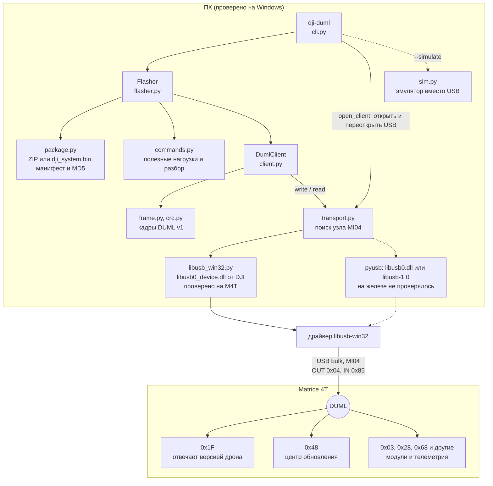
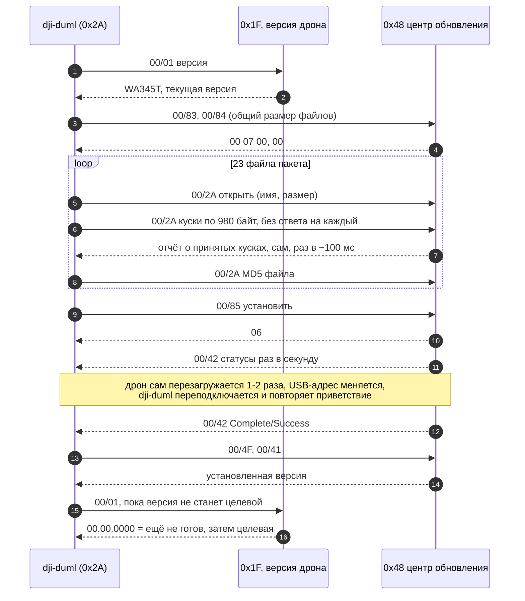

# dji_duml — прошивка DJI Matrice 4T по USB без DJI Assistant

Python-пакет и CLI `dji-duml`, которые говорят с дроном протоколом DJI DUML
напрямую по USB: читают версию, разбирают пакеты прошивки и USB-захваты и
прошивают Matrice 4T тем же способом, что и DJI Assistant 2, но без его окна.

**Статус (2026-10-05): прошивка M4T проверена на железе.** Три прошивки на двух
дронах из официального офлайн-ZIP `M4T_UAV_17.02.05.01_pro.zip` прошли
успешно:

| Дрон | Прогон | Перезагрузки | Время | Итог |
|---|---|---|---|---|
| 1 | Refresh 17.02.0501 → 17.02.0501 | 1 | 205 с | Complete/Success, версия 17.02.0501 |
| 1 | 17.01.0516 → 17.02.0501 | 2 | 357 с | Complete/Success, версия 17.02.0501 |
| 2 | 17.01.0516 → 17.02.0501 | 2 | 358 с | Complete/Success, версия 17.02.0501 |

Процедура повторяет DJI Assistant байт в байт: все 679 445 полезных нагрузок
передачи файлов и все управляющие команды совпадают с USB-захватом
Assistant, а со стороны дрона наш прогон неотличим от его прогона.

> Прошивка — операция с риском для устройства. Используйте только
> официальные пакеты DJI для своей модели; подпись DJI проверяет сам дрон.
> Проверено на двух M4T и одном пакете; на других моделях и версиях — нет.

## Требования

- Windows с установленным DJI Assistant 2 (Enterprise Series): нужен его
  драйвер libusb-win32. Драйверы менять не надо. На Linux и macOS работает
  всё, кроме USB, который там не проверялся.
- Python 3.10+ и `pyusb`.
- DJI Assistant и его службы `DJIService` / `DJIServiceCore` закрыты: USB-
  интерфейс DUML может держать только одна программа.

## Установка

```powershell
git clone <url> m_flasher-dji_duml
cd m_flasher-dji_duml
py -m pip install -e ".[usb]"
dji-duml --help
```

Без установки CLI запускается из папки проекта: `py -m dji_duml --help`
(нужен только `py -m pip install pyusb`).

## Быстрый старт

Проверить связь (только чтение):

```powershell
dji-duml scan       # ровно у одного узла должно быть duml-interface=yes
dji-duml version    # hardware WA345T AC Ver.A, firmware 17.02.0501
```

Посмотреть пакет и точные кадры будущей прошивки (USB не нужен):

```powershell
dji-duml inspect M4T_UAV_17.02.05.01_pro.zip
dji-duml plan M4T_UAV_17.02.05.01_pro.zip
```

Прошить:

```powershell
dji-duml --journal dji-duml-journal/flash.jsonl flash M4T_UAV_17.02.05.01_pro.zip `
    --target 17.02.0501 --expected-current 17.01.0516 --yes
```

- `--target` — версия пакета (сверяется с манифестом внутри пакета),
  `--expected-current` — версия на дроне сейчас (сверяется с дроном).
- Для той же версии добавить `--refresh`.
- Принимаются и офлайн-ZIP, и `dji_system.bin`.
- Ничего не трогать до `Installed …` или ошибки: передача ~1 мин, установка
  с одной-двумя перезагрузками дрона — ещё 2–5 мин. Ctrl+C дрон не
  останавливает.

Прогон на эмуляторе без дрона: `dji-duml --simulate 17.01.0516 flash ...`.

## Коды выхода `flash`

| Код | Исключение | Что значит | Что делать |
|---|---|---|---|
| 0 | — | прошито, версия подтверждена | — |
| 2 | `FlashRefused` | ничего изменяющего не отправлено | исправить причину и повторить |
| 3 | `FlashAborted` | передача начата, установка — нет | перезагрузить дрон по питанию, повторить |
| 4 | `FlashFailed` | дрон сам сообщил об ошибке | прочитать версию, разбираться |
| 5 | `FlashOutcomeUnknown` | установка могла начаться | **не повторять**, не выключать; проверить версию, когда дрон успокоится |

## Как это работает



- **Транспорт.** DUML v1 по USB bulk, интерфейс MI04 (OUT `0x04`, IN `0x85`),
  VID `2CA3` / PID `0020`. DJI ставит libusb-win32 как `libusb0_device.dll` со
  своей раскладкой структур (pyusb на ней падает), поэтому для неё есть своя
  ctypes-обвязка `dji_duml/libusb_win32.py`.
- **Процедура `upgrade-center`.** Хост `0x2A` говорит с модулем `0x48`
  (центр обновления): `00/83` → `00/84` (общий размер) → каждый файл пакета
  по манифесту кадрами `00/2A` (открыть, куски по 980 байт с окном 1250,
  MD5) → `00/85` (установка) → статусы `00/42` через одну-две
  перезагрузки дрона → Complete/Success → `00/4F` (установленная версия) и
  `00/41`. FTP не используется.
- **Гарантии.** Изменяющая команда отправляется ровно один раз; до записи
  сверяются модель, версии и MD5 каждого файла с манифестом; вердикт — только
  Complete от `0x48`; версия `00.00.0000` после перезагрузки означает «ещё не
  готов»; журнал JSONL пишет каждое решение. Подробно — в
  [docs/duml.md](docs/duml.md).



## Документация

- [docs/duml.md](docs/duml.md) — протокол M4T, что и как проверено,
  гарантии автомата, порядок вывода на железо, захват USB, ограничения.
- [docs/dji_assistant.md](docs/dji_assistant.md) — история проекта:
  автоматизация окна DJI Assistant 2 через UI Automation (пакет
  `dji_assistant` живёт в соседнем репозитории) и первые USB-исследования.

## Устройство пакета

| Модуль | Что делает |
|---|---|
| `frame.py`, `crc.py`, `version.py` | кадр DUML v1, CRC8/CRC16, версии DJI |
| `transport.py`, `libusb_win32.py` | USB: выбор узла MI04, pyusb или DLL от DJI |
| `client.py` | запрос/ответ, очередь push-кадров, автоответы, keep-alive, журнал |
| `commands.py` | полезные нагрузки команд и разбор ответов |
| `package.py` | ZIP / `dji_system.bin`: манифест, версия, файлы, MD5 |
| `flasher.py` | автомат прошивки: `upgrade-center` (M4T) и `legacy-ftp` |
| `profiles.py` | константы модели (M4T) с источниками |
| `pcap.py` | разбор USBPcap / usbmon / pcapng |
| `sim.py` | эмулятор дрона и центра обновления M4T для тестов и `--simulate` |
| `cli.py` | `scan`, `version`, `inspect`, `plan`, `decode`, `flash` |

## Тесты

```powershell
$env:PYTHONPATH = "."
py -m unittest discover -s tests -p "test_*.py"
```

129 тестов, без USB и без дрона. Две сверки с захватом DJI Assistant
включаются, если указать пакет и захват:

```powershell
$env:DJI_DUML_PACKAGE = "C:\dev\fw_list\m4t\M4T_UAV_17.02.05.01_pro.zip"
$env:DJI_DUML_CAPTURE = "C:\dev\captures\offline_usb.pcap"
py -m unittest discover -s tests -p "test_duml_assistant_parity.py"
```

## Ограничения

- Проверены одна модель (M4T, два экземпляра) и один пакет (17.02.0501).
- Неудачная прошивка ни разу не записана: коды ошибок дрона известны только
  из публичного перечня.
- Несколько дронов одновременно не поддерживаются.
- Подпись пакета не проверяется — это делает дрон.
