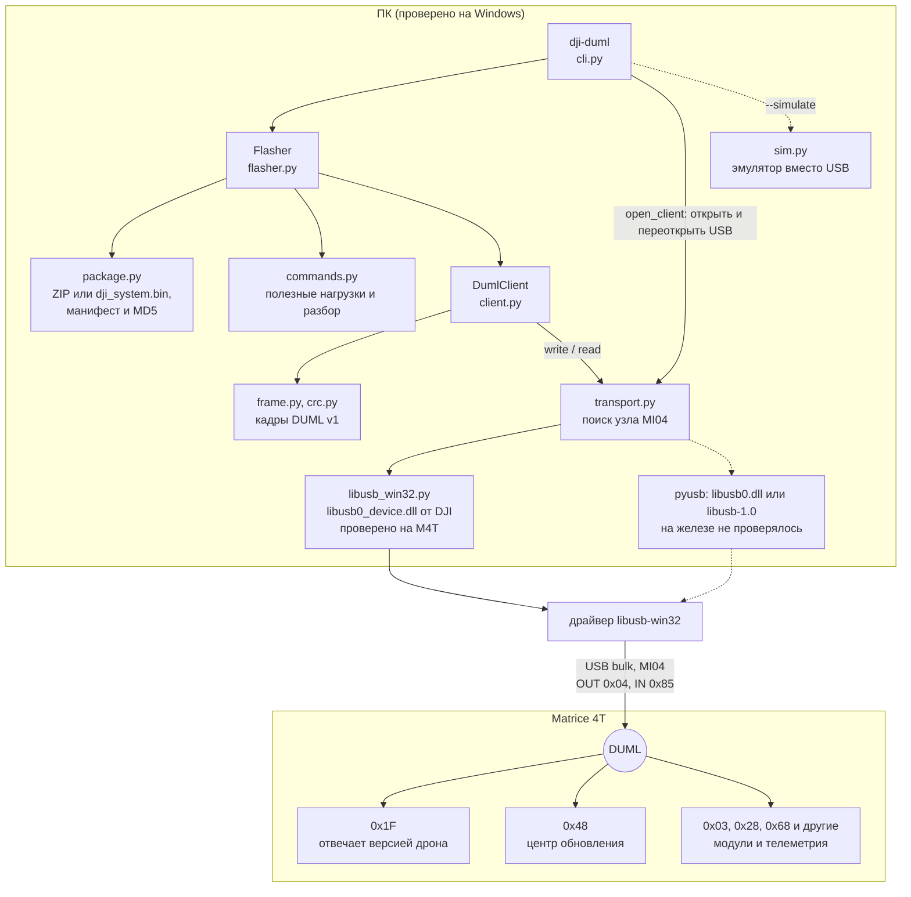
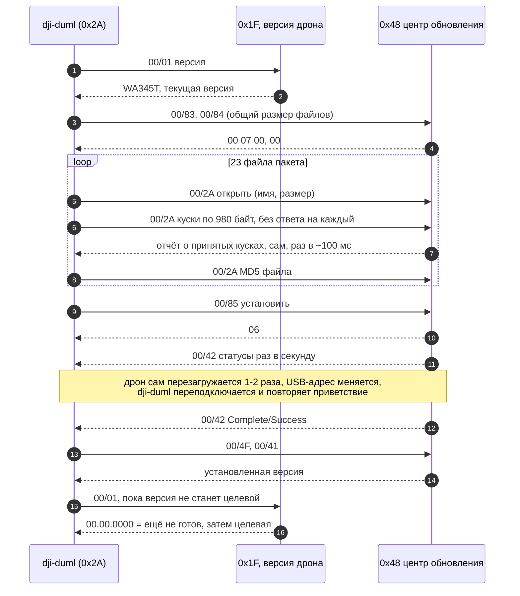

# dji_duml — прошивка DJI Matrice 4T по USB без DJI Assistant

Python-пакет и CLI `dji-duml`, которые говорят с дроном протоколом DJI DUML
напрямую по USB: читают версию, разбирают пакеты прошивки и USB-захваты,
достают из захватов переданную прошивку и прошивают Matrice 4T тем же
способом, что и DJI Assistant 2, но без его окна.

**Статус (2026-10-05): прошивка M4T проверена на железе.** Пять прошивок на
трёх дронах прошли успешно. Четыре из официального офлайн-ZIP
`M4T_UAV_17.02.05.01_pro.zip`, одна — откат на 14.01.0012 из пакета, который
`dji-duml pack` собрал из USB-захвата онлайн-прошивки Assistant:

| Дрон | Прогон | Пакет | Перезагрузки | Время | Итог |
|---|---|---|---|---|---|
| 1 | Refresh 17.02.0501 → 17.02.0501 | ZIP | 1 | 205 с | Complete/Success, версия 17.02.0501 |
| 1 | 17.01.0516 → 17.02.0501 | ZIP | 2 | 357 с | Complete/Success, версия 17.02.0501 |
| 2 | 17.01.0516 → 17.02.0501 | ZIP | 2 | 358 с | Complete/Success, версия 17.02.0501 |
| 3 | 17.01.0516 → 14.01.0012 (откат) | `pack` из захвата | 2 | 442 с | Complete/Success, версия 14.01.0012 |
| 3 | 14.01.0012 → 17.02.0501 | ZIP | 2 | 449 с | Complete/Success, версия 17.02.0501 |

Процедура повторяет DJI Assistant байт в байт: все 679 445 полезных нагрузок
передачи файлов и все управляющие команды совпадают с USB-захватом
Assistant, а со стороны дрона наш прогон неотличим от его прогона. Онлайн-
откат Assistant 17.01.0516 → 14.01.0012 и возврат на 17.01.0516
(2026-10-05) идут той же процедурой: отдельного шага для отката нет.

**Извлечение прошивки из USB-захвата проверено на шести захватах.**
`dji-duml extract` собрал из каждого все переданные файлы, и все прошли
проверки; итог сверен с независимыми источниками:

| Захват | Файлов | Сверено с |
|---|---|---|
| Assistant, офлайн-ZIP → 17.02.0501 | 23 | ZIP: байт в байт |
| dji-duml, Refresh 17.02.0501 | 23 | ZIP: байт в байт |
| dji-duml, 17.01.0516 → 17.02.0501 | 23 | ZIP: байт в байт |
| Assistant, онлайн-Refresh 17.01.0516 | 23 | манифест, независимая сборка: байт в байт |
| Assistant, онлайн-откат 17.01.0516 → 14.01.0012 | 17 | манифест, кэш Assistant: 16 модулей байт в байт |
| Assistant, онлайн 14.01.0012 → 17.01.0516 | 23 | манифест, онлайн-Refresh днём раньше и кэш Assistant: байт в байт |

В обоих онлайн-прогонах 2026-10-05 сумма размеров файлов ровно равна общему
размеру, который Assistant объявил дрону (`00/84`). `.cfg.sig` в кэше
Assistant нет; её подтверждают MD5 из кадра завершения и сошедшийся по ней
манифест.

> Прошивка — операция с риском для устройства. Используйте только
> официальные пакеты DJI для своей модели; подпись DJI проверяет сам дрон.
> Проверено на трёх M4T и двух версиях: 17.02.0501 (офлайн-ZIP) и 14.01.0012
> (пакет из `pack`); на других моделях и версиях — нет.

## Требования

- Windows с установленным DJI Assistant 2 (Enterprise Series): нужен его
  драйвер libusb-win32. Драйверы менять не надо. На Linux и macOS работает
  всё, кроме USB, который там не проверялся.
- Python 3.10+ и `pyusb`.
- DJI Assistant и его службы `DJIService` / `DJIServiceCore` закрыты: USB-
  интерфейс DUML может держать только одна программа.

## Установка

```powershell
git clone <url> m_flasher-dji_duml
cd m_flasher-dji_duml
py -m pip install -e ".[usb]"
dji-duml --help
```

Без установки CLI запускается из папки проекта: `py -m dji_duml --help`
(нужен только `py -m pip install pyusb`).

## Быстрый старт

Проверить связь (только чтение):

```powershell
dji-duml scan       # ровно у одного узла должно быть duml-interface=yes
dji-duml version    # hardware WA345T AC Ver.A, firmware 17.02.0501
```

Посмотреть пакет и управляющие кадры будущей прошивки (USB не нужен):

```powershell
dji-duml inspect M4T_UAV_17.02.05.01_pro.zip
dji-duml plan M4T_UAV_17.02.05.01_pro.zip
```

Прошить:

```powershell
dji-duml --journal dji-duml-journal/flash.jsonl flash M4T_UAV_17.02.05.01_pro.zip `
    --target 17.02.0501 --expected-current 17.01.0516 --yes
```

- `--target` — версия пакета (сверяется с манифестом внутри пакета),
  `--expected-current` — версия на дроне сейчас (сверяется с дроном).
- Для той же версии добавить `--refresh`.
- Принимаются и офлайн-ZIP, и `dji_system.bin`.
- Ничего не трогать до `Installed …` или ошибки: передача ~1 мин, установка
  с одной-двумя перезагрузками дрона — ещё 2–7 мин (весь прогон — от 3,5 до
  7,5 мин). Ctrl+C дрон не останавливает.
- Ход прошивки — по строке на этап. На терминале передача и каждый отрезок
  установки между перезагрузками перерисовываются полосой в одной строке:
  у передачи — со скоростью и оставшимся временем, у установки — со
  временем её начала. В файл или конвейер полоса пишется отдельными
  строками не чаще чем через 10 %. `-v` печатает каждый отчёт о ходе
  отдельной строкой, как раньше:

```text
[10:51:07] preflight
[10:51:07] enter
[10:51:08] transfer  [##############################] 100%  11.6 MB/s  in 0:57
[10:52:06] start  requesting the install
[10:52:06] verify
[10:52:07] upgrading [############------------------]  41%  install since 10:52:06
[10:54:15] reboot  the device restarts; reconnecting
[10:54:59] upgrading [##########################----]  87%  install since 10:52:06
[10:58:11] reboot  the device restarts; reconnecting
[10:58:28] upgrading [##############################] 100%  install since 10:52:06
[10:58:31] confirm  the device reports success; reading the installed version
[10:58:35] done  17.02.0501
Installed 17.02.0501 (was 14.01.0012) in 449 s.
```

Это прогон 14.01.0012 → 17.02.0501 на третьем дроне. Строку `confirm`
печатает текущая версия; в том прогоне на её месте была третья `reboot`.

Прогон на эмуляторе без дрона: `dji-duml --simulate 17.01.0516 flash ...`.

Достать из USB-захвата файлы, которые Assistant или dji-duml передали
дрону (USB не нужен):

```powershell
dji-duml extract capture.pcap -o extracted
```

Каждый файл сверяется с размером и MD5 из кадров передачи и с подписанным
манифестом `.cfg.sig` из того же захвата; не прошедший проверку сохраняется
как `<имя>.incomplete`, причины — на экране и в `extracted\report.json`.
Код выхода: 0 — всё сошлось, 2 — нет, 1 — захват не прочитан. Подробно — в
[docs/duml.md](docs/duml.md#файлы-прошивки-из-захвата-extract).

Собрать из извлечённых файлов пакет для `flash` — так версию, которую
Assistant однажды скачал из сети и передал дрону под USB-захватом, можно
потом ставить без Assistant и интернета:

```powershell
dji-duml extract downgrade_14_usb.pcap -o 14.01.0012_extracted
dji-duml pack 14.01.0012_extracted -o 14.01.0012_dji_system.bin
dji-duml flash 14.01.0012_dji_system.bin --target 14.01.0012 --expected-current 17.01.0516 --yes
```

`pack` берёт `.cfg.sig` и все модули её подписанного манифеста, сверяет
каждый с размером и MD5 из манифеста, собирает несжатый tar, как
`dji_system.bin` (конфигурация, затем модули в порядке манифеста), и
перечитывает его так, как это сделает `flash`. Файлы `*.incomplete` не
берутся; если в папке есть `report.json` от `extract`, `.cfg.sig` должна
быть в нём целой. Так у третьего дрона прошёл откат на 14.01.0012.

## CLI

```text
dji-duml [общие ключи] <команда> [ключи команды]
py -m dji_duml [общие ключи] <команда> [ключи команды]    # без установки
```

Общие ключи пишутся **до** команды: `dji-duml --simulate 17.01.0516 flash ...`.
`dji-duml <команда> --help` печатает справку по команде. Числа в ключах
`decode` и `extract` (адреса, номера) — десятичные без ведущих нулей (`47`)
или с `0x` (`0x2f`); `--usb-location` — строкой, точно как её напечатал `scan`.

### Общие ключи

| Ключ | Что делает |
|---|---|
| `--profile m4t` | модель дрона; пока есть только M4T |
| `--backend auto\|libusb0\|libusb1` | USB-библиотека. `auto`: на Windows сначала libusb0 — если `libusb0.dll` нет, то `libusb0_device.dll` от DJI, — потом libusb-1.0; на Linux и macOS наоборот |
| `--usb-location BUS:ADDR` | какой дрон взять, как его показал `scan`; только для первого подключения, после перезагрузки адрес другой |
| `--serial SERIAL` | какой дрон взять, по серийному номеру USB |
| `--journal PATH` | журнал JSONL для `version` и `flash`: кадры общего набора (версии, команды обновления, статусы) и каждое решение; телеметрия, отчёты о ходе передачи и служебные кадры — счётчиками раз в 10 с, куски файлов — итогом по файлу (`file-sent`). `flash` без ключа пишет его в `dji-duml-journal/<дата-время>-m4t.jsonl` в текущей папке. В журнале серийный номер дрона: не публикуйте |
| `--simulate VERSION` | вместо USB — эмулятор дрона с версией `VERSION`; для `version` и `flash` |

### Команды

| Команда | USB | Что делает | Код выхода |
|---|---|---|---|
| `scan` | только чтение дескрипторов | список узлов M4T; ровно у одного должно быть `duml-interface=yes` | 0 — есть хотя бы один узел с VID/PID дрона (годный ли — по `duml-interface`); 1 — ни одного или не загрузилась USB-библиотека |
| `version [--json]` | только чтение: запрос версии `00/01`, без ответа — до трёх попыток | hardware, firmware, loader и сырой ответ; `--json` — одним объектом | 0, 1 — ошибка |
| `inspect PACKAGE` | нет | модель, версия из манифеста, конфигурация, MD5 и SHA-256 пакета | 0, 1 |
| `plan PACKAGE [--procedure P]` | нет | управляющие кадры `flash` байт в байт (seq обнулён), куски данных — числом; приветствие при подключении (`00/01`, `00/51`, `00/4A` — часы дрона) и служебные кадры сеанса в план не входят. Ничего не отправляет | 0; 2 — `flash` такой пакет не возьмёт. MD5 модулей и проверенность процедуры сверяет только `flash` |
| `decode CAPTURE [...]` | нет | кадры DUML из захвата USBPcap или usbmon (pcap, pcapng) | 0, 1 |
| `extract CAPTURE -o DIR [--device N]` | нет | файлы, переданные центру обновления, с проверкой по MD5 и манифесту | 0 — всё сошлось; 2 — не сошлось или передач нет; 1 — захват не прочитан или `DIR` не новая и не пустая |
| `pack DIR -o FILE` | нет | пакет для `flash` из файлов `extract` | 0, 1 — отказ с причиной |
| `flash PACKAGE --target V --expected-current V --yes` | запись | прошивка | 0, 2–5, 130 — таблица ниже |

`PACKAGE` — офлайн-ZIP DJI, `dji_system.bin` или файл от `pack`.

### Ключи `flash`

| Ключ | Что делает |
|---|---|
| `--target V` | обязателен: версия, которую ставит пакет; сверяется с манифестом внутри пакета |
| `--expected-current V` | обязателен: версия на дроне сейчас; сверяется с дроном до первой изменяющей команды (до сверки уходят только запрос версии `00/01` и служебный keep-alive сеанса) |
| `--yes` | разрешение на запись; без него — код 2, ничего не отправлено |
| `--refresh` | разрешить ту же версию, что уже стоит |
| `--procedure upgrade-center\|legacy-ftp` | по умолчанию `upgrade-center`, проверенная для M4T; `legacy-ftp` — для старых моделей, на M4T только с `--accept-unverified` |
| `--accept-unverified` | запустить процедуру, не проверенную для этой модели |
| `--timeout S` | секунд на установку после команды старта, по умолчанию 1800 |
| `-v`, `--verbose` | каждый отчёт о ходе отдельной строкой вместо полосы |

### Коды выхода `flash`

| Код | Исключение | Что значит | Что делать |
|---|---|---|---|
| 0 | — | прошито, версия подтверждена | — |
| 2 | `FlashRefused` | ничего изменяющего не отправлено | исправить причину и повторить |
| 3 | `FlashAborted` | режим обновления запрошен (`00/83`), установка (`00/85`) — нет; передача могла и не начаться | перезагрузить дрон по питанию, повторить |
| 4 | `FlashFailed` | дрон сам сообщил об ошибке | прочитать версию, разбираться |
| 5 | `FlashOutcomeUnknown` | установка могла начаться | **не повторять**, не выключать; проверить версию, когда дрон успокоится |
| 130 | Ctrl+C | прерван `dji-duml`, не дрон | следовать сообщению: оно зависит от того, на каком этапе прервали |

Остальные ошибки — код 1 и сообщение в stderr: нет файла, пакет не
читается, неверная версия в ключе, ошибка USB у `scan` и `version`. У
`flash` ошибка USB до первой изменяющей команды и пакет не той модели, не
той версии или с неверным MD5 — код 2 (`FlashRefused`). Ошибка в ключах
командной строки — код 2 и `usage:` в stderr от argparse, у любой команды.

### Ключи `decode`

| Ключ | Что делает |
|---|---|
| `--device N` | только USB-устройство с этим адресом |
| `--endpoint EP` | только эта конечная точка, например `0x04` и `0x85`; можно повторять |
| `--cmd-set N` | только этот набор команд |
| `--upgrade-only` | только команды обновления и передачи файлов общего набора |
| `--summary` | сводка: сколько кадров каждой команды |
| `--full` | не обрезать полезную нагрузку |
| `--json` | по объекту JSON на кадр |

## Как это работает



- **Транспорт.** DUML v1 по USB bulk, интерфейс MI04 (OUT `0x04`, IN `0x85`),
  VID `2CA3` / PID `0020`. DJI ставит libusb-win32 как `libusb0_device.dll` со
  своей раскладкой структур (pyusb на ней падает), поэтому для неё есть своя
  ctypes-обвязка `dji_duml/libusb_win32.py`.
- **Процедура `upgrade-center`.** Хост `0x2A` говорит с модулем `0x48`
  (центр обновления): `00/83` → `00/84` (общий размер) → каждый файл пакета
  по манифесту кадрами `00/2A` (открыть, куски по 980 байт с окном 1250,
  потерянный дроном кусок — ещё раз по его отчёту о пропуске, MD5) →
  `00/85` (установка) → статусы `00/42` через одну-две
  перезагрузки дрона → Complete/Success → `00/4F` (установленная версия) и
  `00/41`. FTP не используется.
- **Гарантии.** Изменяющая команда отправляется ровно один раз; до записи
  сверяются модель, версии и MD5 каждого файла с манифестом; вердикт — только
  Complete от `0x48`; версия `00.00.0000` после перезагрузки означает «ещё не
  готов»; журнал JSONL пишет каждое решение. Подробно — в
  [docs/duml.md](docs/duml.md).



## Документация

- [docs/duml.md](docs/duml.md) — протокол M4T, что и как проверено,
  гарантии автомата, порядок вывода на железо, захват USB, ограничения.
- [docs/dji_assistant.md](docs/dji_assistant.md) — история проекта:
  автоматизация окна DJI Assistant 2 через UI Automation (пакет
  `dji_assistant` живёт в соседнем репозитории) и первые USB-исследования.

## Устройство пакета

| Модуль | Что делает |
|---|---|
| `frame.py`, `crc.py`, `version.py` | кадр DUML v1, CRC8/CRC16, версии DJI |
| `transport.py`, `libusb_win32.py` | USB: выбор узла MI04, pyusb или DLL от DJI |
| `client.py` | запрос/ответ, очередь push-кадров, автоответы, keep-alive, журнал |
| `commands.py` | полезные нагрузки команд и разбор ответов |
| `package.py` | ZIP / `dji_system.bin`: манифест, версия, файлы, MD5 |
| `flasher.py` | автомат прошивки: `upgrade-center` (M4T) и `legacy-ftp` |
| `profiles.py` | константы модели (M4T) с источниками |
| `pcap.py` | разбор USBPcap / usbmon / pcapng |
| `extract.py` | файлы из передач `00/2A` в захвате, с проверкой по MD5 и манифесту |
| `pack.py` | пакет как `dji_system.bin` из извлечённых файлов, по манифесту |
| `display.py` | вывод хода прошивки: строка на этап, полоса прогресса |
| `sim.py` | эмулятор дрона и центра обновления M4T для тестов и `--simulate` |
| `cli.py` | `scan`, `version`, `inspect`, `plan`, `decode`, `extract`, `pack`, `flash` |

## Тесты

```powershell
$env:PYTHONPATH = "."
py -m unittest discover -s tests -p "test_*.py"
```

191 тест, без USB и без дрона. Три сверки с захватом включаются, если
указать пакет и захват его прошивки:

```powershell
$env:DJI_DUML_PACKAGE = "C:\dev\fw_list\m4t\M4T_UAV_17.02.05.01_pro.zip"
$env:DJI_DUML_CAPTURE = "C:\dev\captures\offline_usb.pcap"
py -m unittest discover -s tests -p "test_duml_assistant_parity.py"
py -m unittest discover -s tests -p "test_duml_extract.py"
```

## Ограничения

- Прошивка `dji-duml` проверена на одной модели (M4T, три экземпляра) и
  двух версиях: 17.02.0501 (ZIP) и 14.01.0012 (пакет из `pack`). Пакетом
  17.01.0516 наш `flash` ещё не запускался; по захвату Assistant процедура
  та же.
- Неудачная прошивка ни разу не записана: коды ошибок дрона известны только
  из публичного перечня.
- Несколько дронов одновременно не поддерживаются.
- Подпись пакета не проверяется — это делает дрон.
