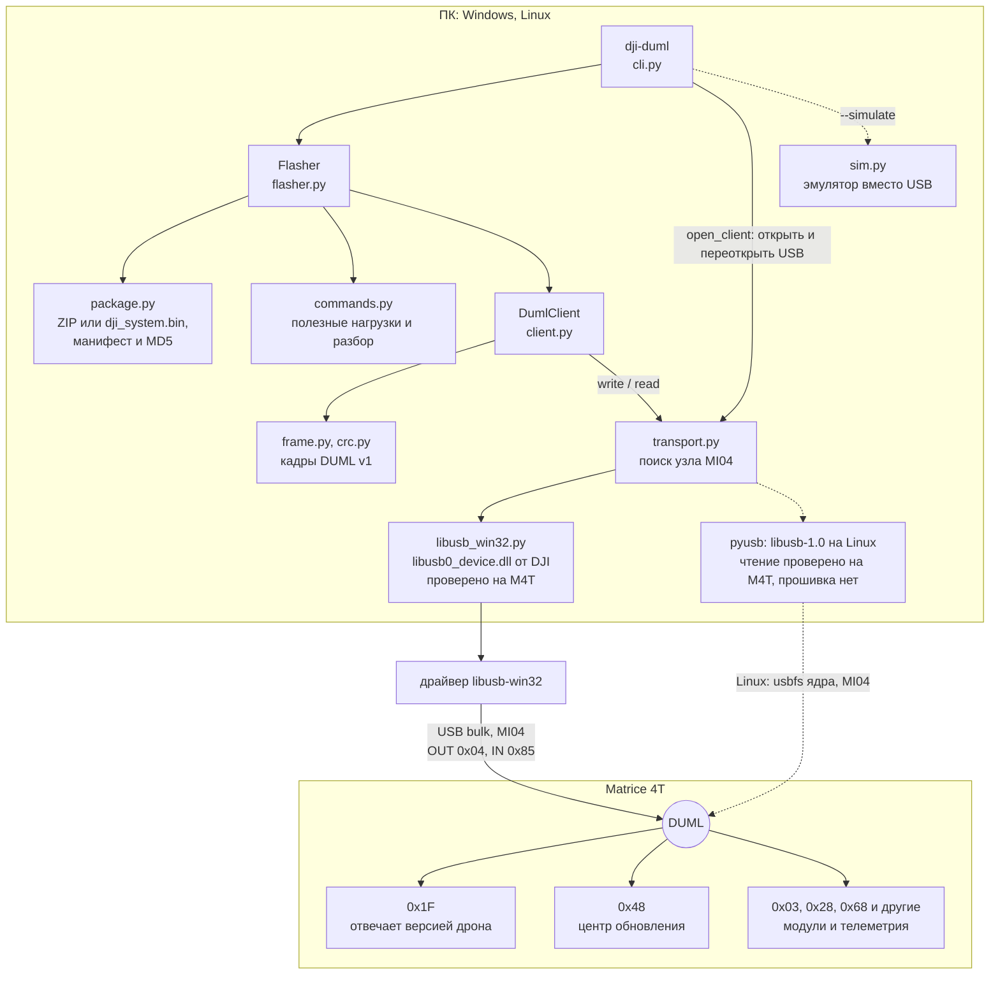
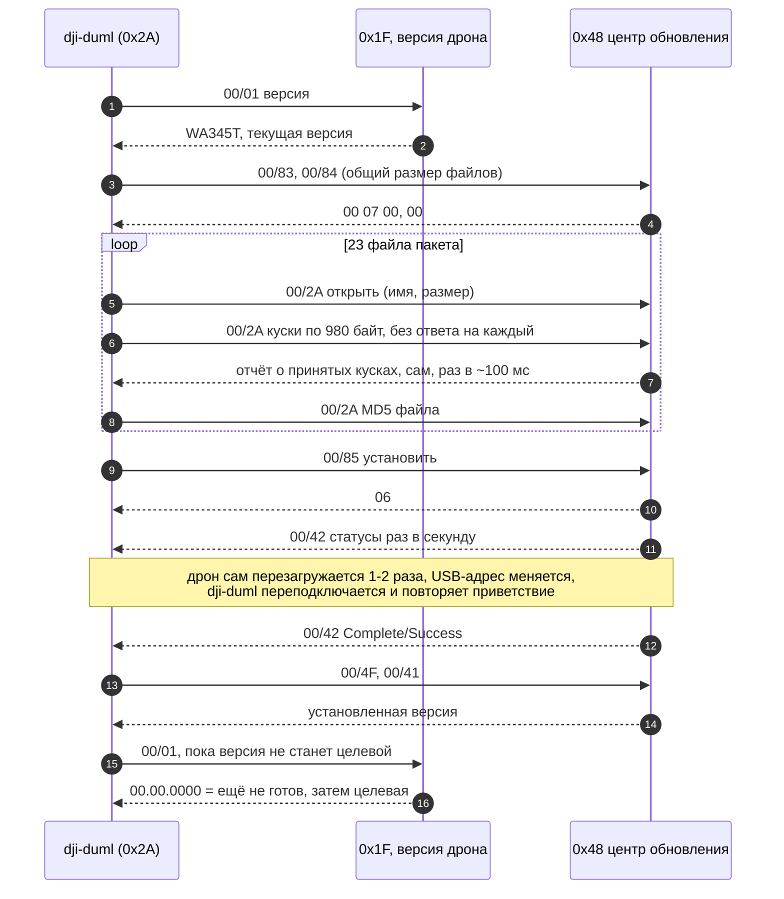

[← README](../README.md)

# Как это работает

- **Транспорт.** DUML v1 по USB bulk, интерфейс MI04 (OUT `0x04`, IN `0x85`),
  VID `2CA3` / PID `0020`. DJI ставит libusb-win32 как `libusb0_device.dll` со
  своей раскладкой структур (pyusb на ней падает), поэтому для неё есть своя
  ctypes-обвязка `dji_duml/libusb_win32.py`.
- **Процедура `upgrade-center`.** Хост `0x2A` говорит с модулем `0x48`
  (центр обновления): `00/83` → `00/84` (общий размер) → каждый файл пакета
  по манифесту кадрами `00/2A` (открыть, куски по 980 байт с окном 1250,
  потерянный дроном кусок — ещё раз по его отчёту о пропуске, MD5) →
  `00/85` (установка) → статусы `00/42` через одну-две
  перезагрузки дрона → Complete/Success → `00/4F` (установленная версия) и
  `00/41`. FTP не используется.
- **Гарантии.** Изменяющая команда отправляется ровно один раз; до записи
  сверяются модель, версии и MD5 каждого файла с манифестом; вердикт — только
  Complete от `0x48`; версия `00.00.0000` после перезагрузки означает «ещё не
  готов»; журнал JSONL пишет каждое решение. Подробно — в
  [duml.md](duml.md).

