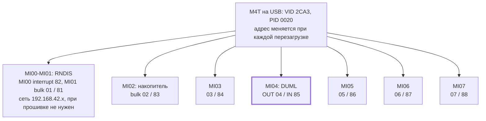
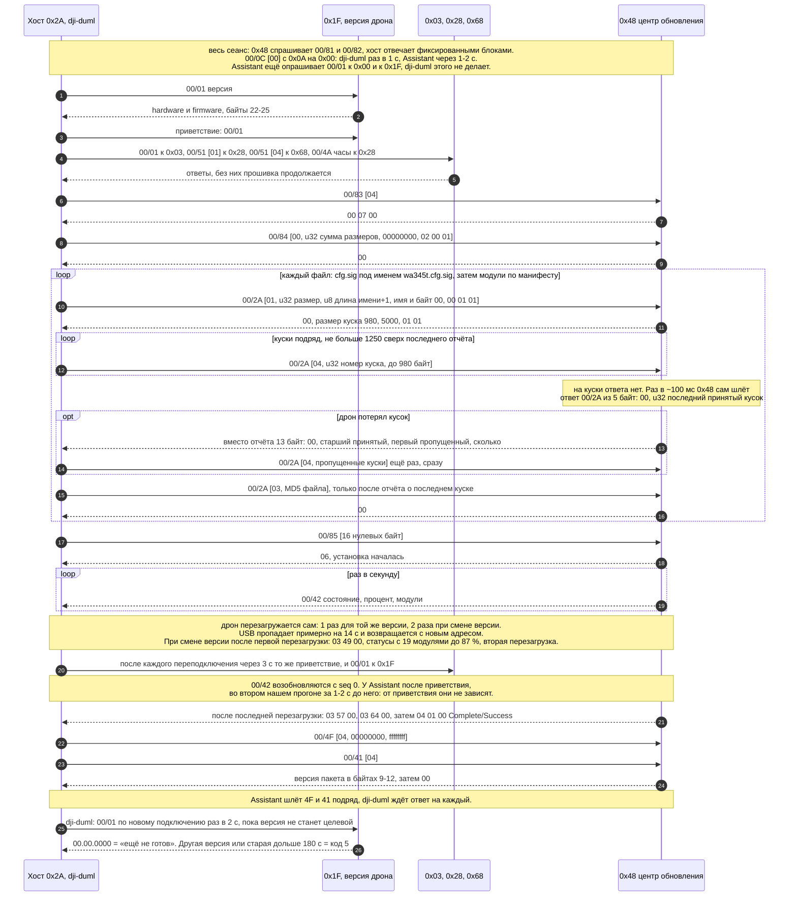
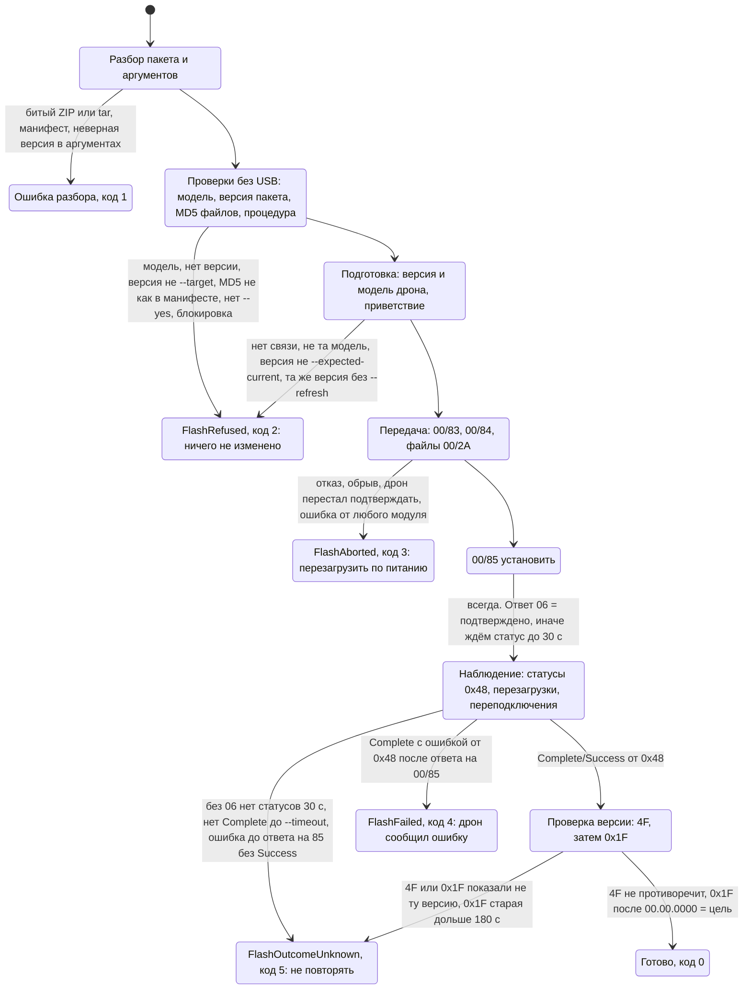

# dji_duml — прямой DUML по USB

Альтернатива UI-автоматизации: пакет говорит с дроном по USB bulk напрямую,
без DJI Assistant, окна и Windows desktop. Работает на Windows, Linux и
macOS; из зависимостей только `pyusb`, и только для реального USB.

```powershell
pip install -e ".[usb]"
dji-duml --help
```

## Что подтверждено, а что нет

| Часть | Основание | Статус |
|---|---|---|
| Кадр DUML v1, CRC8/CRC16 | 4 эталонных пакета публичных инструментов воспроизводятся байт в байт | проверено тестами |
| Адреса M4T `2A → 1F`, MI04, OUT 04 / IN 85 | захват Assistant; `dji-duml version` 2026-10-04 | **проверено на M4T** |
| Version Inquiry (set 00, id 01) | собственный запрос 2026-10-04, ответ с первой попытки | **проверено на M4T** |
| Смещения полей ответа версии | hardware 2..17, loader 18..21, firmware 22..25 = `17.02.0501`, как Current в Assistant; хвост `01 00 00 c0 00` не расшифрован | **проверено на M4T** |
| USB-транспорт (Windows) | DJI `libusb0_device.dll` через `libusb_win32` (раскладка `usb_device` из кода DLL); `scan` + `version` | **проверено на M4T** |
| USB-транспорт через pyusb и libusb-1.0 (Linux) | логика выбора узла покрыта mock-тестами; Gentoo, Python 3.14, правило udev без root | **проверено на M4T 2026-10-05**: `scan`, `version`, `manifest`, `params` — те же ответы, что на Windows; прошивка на Linux ещё не запускалась |
| USB-транспорт через pyusb и `libusb0.dll` (Windows без DLL от DJI) | логика выбора узла покрыта mock-тестами | на железе не запускался |
| Разбор USBPcap | три захвата Assistant с M4T (710 МБ, ~690 тыс. кадров) | **проверено на реальных захватах** |
| `extract`: файлы из захвата | 6 захватов (4 Assistant, 2 наших), все проверки пройдены. Офлайн-захват Assistant и оба наших: по 23 файла, байт в байт равны файлам ZIP 17.02.0501. Онлайн-Refresh 17.01.0516: 23 файла, сходятся с манифестом и с независимой сборкой. 2026-10-05 онлайн-откат → 14.01.0012: 17 файлов по манифесту 14.01.0012; онлайн-возврат → 17.01.0516: 23 файла, байт в байт равны файлам Refresh 2026-10-04. В обоих все модули байт в байт равны скачанным Assistant в `DJIEngine\DJIData\firm_cache` (`.cfg.sig` там нет), сумма размеров равна общему размеру из `00/84` | **проверено на реальных захватах** |
| Процедура `upgrade-center` (по умолчанию для M4T) | три захвата Assistant; все 679 445 полезных нагрузок `00/2A` и `83/84/85/4F/41` для ZIP 17.02.0501 совпадают с отправленными Assistant байт в байт (`test_duml_assistant_parity`) | **проверено на M4T 2026-10-04**: Refresh 17.02.0501 (одна перезагрузка, 205 с) и смена версии 17.01.0516 → 17.02.0501 (две перезагрузки, 357 с), обе из ZIP; 2026-10-05 — второй M4T, 17.01.0516 → 17.02.0501 (358 с); Complete/Success от `0x48`, `4F` = 17.02.0501; в `verified_procedures` |
| Повтор потерянного куска | отчёт о пропуске (13 байт) в 1 из 6 захватов с передачей файлов, два раза; тест паритета с этим захватом: dji-duml пересылает те же куски с теми же байтами; эмулятор теряет куски (в середине и в конце файла, повторно, с пачками отчётов) | проверено на захвате и эмуляторе; в пяти прогонах dji-duml на железе дрон кусков не терял |
| `pack`: пакет из извлечённых файлов | пакеты 17.01.0516 и 14.01.0012 из захватов Assistant 2026-10-05: тест паритета — dji-duml отправляет те же кадры `00/2A` и управляющие команды, что и Assistant; пакет у пользователя собрался байт в байт таким же (MD5 `b23b8d43…`) | **проверено на M4T 2026-10-05**: третий дрон, откат 17.01.0516 → 14.01.0012 этим пакетом (две перезагрузки, 442 с), затем 14.01.0012 → 17.02.0501 из ZIP (449 с); Complete/Success, версии подтверждены |
| `manifest`: `.cfg.sig` установленной прошивки | `00/4F` тип 01, как Assistant при подключении (`idle.pcap`): 101 кусок по 256 байт, байт в байт `.cfg.sig` ZIP 17.02.0501 | **проверено на M4T 2026-10-05**: дрон на 16.01.0006, 22 модуля, `--compare` с ZIP 17.02.0501 перечислил отличия |
| `params`: параметры полётного контроллера | `03/E0`, `03/E1`, `03/E2` по захвату `idle.pcap` (1563 индекса, 907 параметров на 17.02.0501); `03/DF`, записи и `03/E9` не отправляются | **проверено на M4T 2026-10-05**: без `03/DF`, 1562 индекса и 905 параметров на 16.01.0006 |
| Процедура `legacy-ftp` | pyduml, устройства эпохи Mavic Pro | **M4T её не использует** (FTP в захватах нет) |

Процедура `upgrade-center` повторяет DJI Assistant (раздел ниже) и для M4T
внесена в `verified_procedures`. Другие процедуры `flash` для M4T выполняет
только с `--accept-unverified`.
Процедура `legacy-ftp` (pyduml: `07` → `0C` → FTP на `192.168.42.2` →
`08` → `0A`) остаётся для других моделей; M4T так не прошивается.

## Команды

```powershell
dji-duml scan                         # только стандартные descriptor-запросы
dji-duml version                      # один read-only запрос, показывает и сырой ответ
dji-duml inspect dji_system.bin       # модель, версия, MD5/SHA-256; без USB
dji-duml plan M4T_UAV_17.02.05.01_pro.zip   # точные кадры будущей прошивки; ничего не отправляет
dji-duml decode capture.pcap --device 47 --endpoint 0x04 --endpoint 0x85 --upgrade-only
dji-duml topology --capture capture.pcap             # реальные DUML type:index из трафика
dji-duml topology --seconds 10 -v                    # live fingerprint: Hz/len/unique/seq
dji-duml topology --seconds 10 -v --assistant-session # + replies 81/82 and captured 00/0C keepalive
dji-duml topology --seconds 3 --probe 0x1f           # live: пассивно + явный read-only probe
dji-duml extract capture.pcap -o files   # файлы, отправленные центру обновления, с проверкой
dji-duml pack files -o 17.01.0516_dji_system.bin   # пакет для flash из извлечённых файлов
dji-duml manifest --compare M4T_UAV_17.02.05.01_pro.zip   # что ровно стоит на дроне; только чтение
dji-duml params --changed              # параметры полётного контроллера; только чтение
dji-duml flash M4T_UAV_17.02.05.01_pro.zip --target 17.02.0501 --expected-current 17.01.0516 --yes
dji-duml flash ... -v                 # каждый отчёт о ходе отдельной строкой, как раньше
dji-duml --simulate 17.01.0516 flash ... --accept-unverified   # прогон на эмуляторе
```

### Прошивка M4T по шагам (как в прогоне 2026-10-04)

1. Закрыть DJI Assistant вместе с `DJIService` и `DJIServiceCore`.
   Аккумулятор дрона заряжен, пропеллеры сняты.
2. По желанию — USB-захват для разбора (PowerShell от администратора;
   адрес дрона: `USBPcapCMD.exe --extcap-interface \\.\USBPcap1 --extcap-config`):
   `Start-Process USBPcapCMD.exe -ArgumentList '-d','\\.\USBPcap1','--devices','<адрес>','--capture-from-new-devices','--inject-descriptors','-o','capture.pcap'`.
   Не использовать `-A`: на том же хабе клавиатура. Останавливать
   `Stop-Process -Name USBPcapCMD`, Ctrl+C его не останавливает.
3. Из папки проекта: `py -m dji_duml --journal dji-duml-journal/<имя>.jsonl flash
   <ZIP или dji_system.bin> --target <версия пакета> --expected-current
   <текущая версия> --yes` (для той же версии ещё `--refresh`).
   `--usb-location` не нужен: узел MI04 находится сам.
4. Ничего не трогать до `Installed …` или ошибки: передача ~1–1,5 мин,
   установка с перезагрузками — ещё 2–5 мин.

DJI Assistant и его сервисы должны быть закрыты: интерфейс MI04 может
держать только одна программа. Драйверы менять не нужно: на Windows
используется уже установленный libusb-win32 (backend `libusb0`). DJI ставит
его DLL как `libusb0_device.dll` со своей раскладкой структур; pyusb на ней
падает, поэтому она подключается через `dji_duml/libusb_win32.py`.



MI03-MI07 — vendor-интерфейсы (class FF / 43 / 01); libusb-win32 видит
каждый отдельным узлом, и только у MI04 есть пара эндпоинтов DUML.

На M4T каждый vendor-интерфейс виден отдельным узлом libusb-win32, и узел
отдаёт конфигурацию только со своим интерфейсом: в `scan` ровно у одного
узла `duml-interface=yes`. Его `location` можно передать в `--usb-location`;
он действует только на первое подключение, потому что после каждой
перезагрузки дрон получает новый USB-адрес.

По MI04 постоянно идёт телеметрия (около 1400 кадров/с на 2026-10-04:
подвес `04/05`, полётный контроллер `03/43`, модули `0x92`, `0x48`), в том
числе на адреса `0A` и `8A`. В журнал они попадают только счётчиками.


### DUML topology / discovery

`dji-duml topology` строит карту адресов DUML без предположения, что любой
адрес-получатель означает реально присутствующий модуль.

- `+` (**confirmed**) — с адреса реально пришёл CRC-valid DUML frame либо адрес
  ответил на явно запрошенный read-only `GENERAL/01 Version Inquiry`.
- `?` (**candidate**) — адрес встречался только как receiver. Это полезная
  зацепка, но не доказательство существования endpoint.
- индекс берётся прямо из старших 3 бит DUML-адреса, поэтому `Camera 1:0` и
  `Camera 1:2` учитываются как разные модули.
- passive capture ничего не отправляет устройству.
- live active probe выполняется **только** для адресов, переданных через
  `--probe`; скрытого перебора всех 256 адресов нет, retries нет.

Пример:

```text
DUML topology: 184235 frames, 5 confirmed, 2 candidates
+ 0x03  Flight Controller idx=0  passive  tx=63120 rx=18
    commands: 03/43 x42081, 03/57 x10520, ...
+ 0x44  Gimbal idx=2  passive  tx=18750 rx=0
    commands: 04/05 x18750
? 0x0A  PC idx=0  receiver-only  rx=900
```

Для машинной обработки есть `--json`; там сохраняются счётчики tx/rx,
наблюдавшиеся `cmd_set/cmd_id` и fingerprints потоков. `-v/--verbose`
показывает для каждого sender→receiver/cmd потока частоту, диапазон длины
payload, число уникальных payload, ACK, seq-delta, printable ASCII и карту
изменяющихся offsets. Для FLYC `03/43` дополнительно декодируется только
подтверждённый 36-байтовый legacy-prefix (height/velocity/attitude/state);
M4T-хвост остаётся raw.

`--assistant-session` не выполняет discovery writes: он только отвечает на
наблюдённые M4T `00/81/82` теми же reply, что DJI Assistant, и шлёт
захваченный Assistant keepalive `0x0A -> 0x00, 00/0C [00]` раз в секунду.
Флаг нужен для сравнения passive traffic с устойчивой host-session; без него
`topology` ничего не отправляет, кроме явно заданных `--probe`.

## Кадр DUML v1

| Байты | Поле |
|---|---|
| 0 | `0x55` |
| 1-2 | длина кадра (10 бит) + версия протокола `1` (биты 10-15), little-endian |
| 3 | CRC8 байтов 0-2 (отражённый полином `0x8C`, начальное `0x77`) |
| 4 | отправитель: тип (биты 0-4) + индекс (биты 5-7); `0x2A` = ПК, индекс 1 |
| 5 | получатель, так же |
| 6-7 | `seq`, little-endian; ответ повторяет `seq` запроса |
| 8 | бит 7 — ответ, биты 5-6 — какой ответ нужен, биты 3-4 — резерв, биты 0-2 — шифрование |
| 9 | набор команд (`0x00` — общий) |
| 10 | команда |
| 11 … n-3 | данные, до 1010 байт |
| n-2 … n-1 | CRC16 байтов 0 … n-3 (отражённый `0x8408`, начальное `0x3692`), little-endian |

## Как Assistant прошивает M4T



Три USBPcap-захвата 2026-10-04: хвост отката 17.02.0501 → 17.01.0516 (с
«Updating 43%»), полный онлайн-Refresh 17.01.0516 и полный офлайн-апгрейд
ZIP → 17.02.0501. FTP и TCP по RNDIS нет: всё идёт кадрами DUML по MI04.
Все команды обновления — от `0x2A` модулю **`0x48`** (тип 8, индекс 2,
`0802`, «upgrade center»), `cmd_type 0x40`. Два онлайн-прогона Assistant
2026-10-05 идут тем же порядком, отдельного шага для отката нет:

- откат 17.01.0516 → 14.01.0012 (`downgrade_14_usb.pcap`): 17 файлов за
  57 с, `00/85` → `06`, две перезагрузки, Complete через 378 с после
  `00/85`, `00/4F` = 14.01.0012;
- возврат 14.01.0012 → 17.01.0516 (`upgrade_17_usb.pcap`): 23 файла за
  61 с, две перезагрузки, Complete через 381 с, `00/4F` = 17.01.0516.

1. `00/83` `[04]` → `00 07 00` (~0,85 с).
2. `00/84` `00 | u32 сумма размеров всех файлов | 00000000 | 02 00 01` → `00`.
3. Для каждого файла пакета в порядке манифеста (сначала `.cfg.sig` под
   именем `wa345t.cfg.sig`, затем `<release><module>`):
   - `00/2A` `01 | u32 размер | u8 длина имени+1 | имя\0 | 00 01 01` →
     `00 | u16 980 | u16 5000 | 01 01`;
   - `00/2A` `04 | u32 номер куска | 980 байт` без ответа на кусок; `0x48`
     сам раз в ~100 мс присылает `00/2A` (ответ, 5 байт) `00 | u32 последний
     принятый кусок`; хост держит не больше 1250 кусков сверх него;
   - если дрон потерял кусок, вместо очередного отчёта (со следующим `seq`)
     он присылает отчёт о пропуске из 13 байт `00 | u32 старший принятый |
     u32 первый пропущенный | u32 сколько`, и хост сразу шлёт эти куски
     ещё раз. В `upgrade_17_usb.pcap` так было дважды, по одному куску
     (195647 и 298203); Assistant переслал каждый через ~1,5 мс, следующие
     отчёты были обычными. В остальных пяти захватах с передачей пропусков
     нет (в седьмом, хвосте отката 2026-10-04, передачи нет);
   - после отчёта о последнем куске `00/2A` `03 | MD5 файла` (= `md5` в
     манифесте) → `00`.
   Ответы отличаются от отчётов о ходе передачи только длиной (7 / 1 / 5 /
   13).
4. `00/85` `16 × 00` → `06` (не ошибка); дальше дрон ставит прошивку сам.
5. `00/42` от `0x48` раз в секунду: `состояние | процент | N | N × 8 байт`
   (адрес модуля, состояние, процент). Дрон сам перезагружается: один раз
   при Refresh, дважды при смене версии; USB-адрес меняется, статусы
   начинаются заново с `seq 0`.
6. После каждого переподключения Assistant: `00/01` к `0x1F` и `0x03`,
   `00/51 [01]` к `0x28`, `00/51 [04]` к `0x68`, `00/4A` (дата и время) к
   `0x28`, через 3–4 с после появления дрона. В пяти переподключениях
   Assistant и в первом нашем прогоне статусы шли после этого, но во втором
   нашем прогоне (обе перезагрузки) — за 1–2 с до него, так что от
   приветствия они, видимо, не зависят. `upgrade-center` всё равно
   здоровается, через 3 с (`greet_delay`): через 0,3 с модуль `0x68` ещё не
   отвечал.
7. Вердикт — `04 01 00` (Complete/Success). Сразу после него `00/4F`
   `04 00000000 ffffffff` → версия пакета в байтах 9..12 (по одному
   десятичному полю: `01 05 02 11` = 17.02.0501) и `00/41 [04]` → `00`.
8. `0x1F` после перезагрузки отвечает версией `00000000` до нескольких
   минут; это «ещё не готов», а не версия.

Всё время Assistant отвечает на запросы `0x48` `00/81` (64-байтный блок) и
`00/82` (`00`) и шлёт `00/0C [00]` с `0x0A` на `0x00`. Нужны ли они, не
проверено; `upgrade-center` делает так же. Неудачный прогон не записан:
коды ошибок известны только из публичного перечня.

## Файлы прошивки из захвата: `extract`

`dji-duml extract захват.pcap -o папка` собирает файлы, которые хост
(Assistant или dji-duml) передал центру обновления кадрами `00/2A`, и
кладёт их в новую или пустую папку вместе с `report.json`. Захват читается
потоком, куски сразу пишутся на диск по своему номеру, так что 700-МБ захват
разбирается за ~25 с и не требует памяти под файлы. Вместе файлы никогда не
занимают на диске больше размера захвата.

Файл получает своё имя, только если прошёл все проверки:

- есть все куски; повтор куска совпадает с первым (сверка по BLAKE2b);
  все куски, кроме последнего, одного размера — того, что дрон назвал в
  ответе на открытие, если этот ответ есть в захвате;
- длина равна размеру из кадра открытия, MD5 — MD5 из кадра завершения;
- дрон не отклонил ни открытие, ни завершение;
- если этот USB-дрон получил в захвате `.cfg.sig`, файл отправлен после
  неё, есть в её подписанном манифесте, и размер и MD5 равны записанным
  там. Файл, отправленный до `.cfg.sig`, и файлы после испорченной
  `.cfg.sig` проверку не проходят.

Иначе файл сохраняется как `<имя>.incomplete`, а причины пишутся в отчёт и
на экран, там же замечания (например, что ответа дрона нет в захвате).
Сеанс без какого-то модуля из манифеста тоже считается неполным. Повтор
имени получает номер: `<имя>.2`, `<имя>.2.incomplete`.

Код выхода: 0 — всё сошлось; 2 — что-то не сошлось или передач в захвате
нет; 1 — захват не прочитан или папка не новая и не пустая. При ошибке
посреди работы папка остаётся пустой, и запуск можно повторить.

Имя из кадра открытия используется, только если это простое имя файла
(буквы, цифры, `._+-`, не `CON`/`NUL` и т. п., не `*.incomplete`) и его
удалось создать; иначе файл называется `transfer-NNN.bin`. Подпись DJI не
проверяется: это делает дрон.

## Порядок вывода на железо

1. ~~`scan`, затем `version`~~ — сделано 2026-10-04, версия на байтах 22..25.
2. ~~Захват штатной прошивки через Assistant~~ — сделано, три захвата.
3. ~~Сверить `plan` с захватом~~ — полезные нагрузки совпадают байт в байт
   (`DJI_DUML_PACKAGE=... DJI_DUML_CAPTURE=... test_duml_assistant_parity`).
4. ~~Первый прогон нашим кодом~~ — 2026-10-04: Refresh 17.02.0501 из ZIP,
   `--accept-unverified`, Assistant закрыт, параллельный USBPcap-захват
   (`C:\dev\captures\ours_usb.pcap`). Передача 23 файлов ~97 с (~6,8 МБ/с),
   `85` → `06`, статусы `0x48` 3 → 87 %, перезагрузка (USB ~14 с),
   приветствие (только `00/51` к `0x68` не ответил за 2 с), `87 → 100 %`,
   `04 01 00`, `4F` = 17.02.0501, `0x1F` дважды `00.00.0000`, затем
   17.02.0501. Всего 205 с.
5. Сравнение нашего захвата с захватами Assistant (2026-10-04): все 51
   управляющий запрос к `0x48` и ответы, все 679 445 полезных нагрузок
   `00/2A` совпали с офлайн-прошивкой Assistant тем же ZIP; установка шла в
   том же темпе (79 статусов, от `06` до Complete 101,7 с против 101,2 с).
   Отличия были только на стороне хоста; исправлено: CRC16 через
   `binascii.crc_hqx` (в ~17 раз быстрее), без `fsync` на каждом кадре
   (из-за него один отчёт о ходе передачи потерялся), приветствие через 3 с.
6. ~~Смена версии нашим кодом~~ — 2026-10-04: 17.01.0516 → 17.02.0501 из ZIP
   после отката через Assistant (захват `C:\dev\captures\ours_upgrade_usb.pcap`,
   журнал `dji-duml-journal/second-flash.jsonl`). Передача 64,5 с (после
   ускорения CRC и журнала), `85` → `06`, 73 % → перезагрузка (USB 14,1 с) →
   статусы с 19 модулями → 87 % → вторая перезагрузка (14,2 с) → 100 % →
   `04 01 00`, `4F` = 17.02.0501. Всего 357 с.
7. `upgrade-center` внесена в `verified_procedures` профиля M4T.
8. 2026-10-05, второй M4T (тоже `WA345T AC Ver.A`, раскладка ответа версии
   та же): 17.01.0516 → 17.02.0501 из ZIP без `--accept-unverified`.
   Передача 58 с, `85` → `06`, две перезагрузки (USB 14,2 и 14,1 с),
   Complete/Success от `0x48`, `4F` = 17.02.0501. Всего 358 с.

## Гарантии автомата прошивки

- Каждая изменяющая команда отправляется ровно один раз. Повторяется только
  чтение версии.
- До записи сверяются: модель по hardware-строке, по имени `.cfg.sig` и,
  если он читается, по XML-манифесту внутри него; текущая версия;
  неизменность файла; версия пакета с `--target`. В `dji_system.bin` версия
  есть только в манифесте (`<firmware formal>` / `<release version>`): имя
  `wa345t.cfg.sig` её не содержит. Пакет без читаемой версии не
  прошивается; расхождение имени и манифеста — ошибка пакета. MD5 считается
  и по файлу, и по реально отправленным байтам.
- После запроса старта flasher только наблюдает. Обрыв USB или таймаут не
  считается вердиктом: итог определяется перечитыванием версии после
  перезагрузки.
- Перед стартом (`00/85` у `upgrade-center`, `0A` у `legacy-ftp`) поток
  вычитывается до тишины (не дольше 0,3 с и 5 с соответственно), и ошибка из
  него отменяет старт. Статусы, пришедшие раньше ответа на старт или вместо него,
  журналируются как `status-before-reply` и вердиктом не считаются: успех
  среди них ничего не доказывает, а ошибка делает исход неизвестным (код 5),
  если за ней не последовал Complete/Success. Перечитанная версия такую
  ошибку не отменяет.
- Вердиктом считаются только статусы модуля, который ведёт обновление:
  `0x48` у `upgrade-center`, `0x1F` у `legacy-ftp`; адрес получателя не
  проверяется. Статусы других модулей журналируются как `status-ignored`.
  До старта ошибка от любого модуля отменяет запуск.
- Перепрошивка той же версии (`--refresh`) подтверждается только push-статусом
  Complete/Success: версия в этом случае ничего не доказывает.
- `--timeout` отсчитывается от запроса старта; медленная передача образа его
  не расходует.
- Шум в потоке, похожий на заголовок кадра, отбрасывается, если 0,2 с не
  собирается ни одного кадра, даже когда байты телеметрии идут непрерывно;
  с шагом чтения 0,25 с задержка не больше ~0,5 с.
- Журнал JSONL (`dji-duml-journal/`) содержит каждое решение (с `fsync`),
  каждый отправленный кадр и принятые кадры набора `00` (без `fsync`: он
  останавливал чтение до 0,5 с). Телеметрия, отчёты о ходе передачи `00/2A`
  и запросы `00/81`/`00/82` записываются счётчиками раз в 10 с (`rx-counted`).
- Межпроцессная блокировка не даёт двум процессам прошивать одну модель.



До `00/85` автомат завершает работу кодами 2 и 3: установка не начиналась.
Ошибки разбора пакета и аргументов дают код 1. После `00/85` автомат только
наблюдает, и повторять запуск небезопасно: код 4 — только Complete с ошибкой
от `0x48` после ответа на `00/85`, всё остальное — код 5, в том числе
нестандартный ответ на `00/85`. Ctrl+C даёт код 130 и сообщает, началась ли
установка.

| Исключение | Код | Что это значит |
|---|---|---|
| `FlashRefused` | 2 | ничего изменяющего не отправлено, можно исправить и повторить |
| `FlashAborted` | 3 | вошли в режим обновления, прошивка не стартовала; перезапустить питание |
| `FlashFailed` | 4 | устройство само сообщило об ошибке |
| `FlashOutcomeUnknown` | 5 | старт мог быть доставлен; не повторять, проверить версию вручную |

Ctrl+C во время прошивки не останавливает устройство; CLI сообщает,
началась запись или нет.

## Ограничения

- `upgrade-center` принимает и `dji_system.bin`, и офлайн-ZIP: в обоих
  те же файлы, перечисленные в манифесте. `legacy-ftp` — только tar.
- Подпись DJI не проверяется: это делает устройство.
- Несколько дронов одной модели одновременно не поддержаны: блокировка
  одна на модель, а дрон меняет USB-адрес при каждой перезагрузке.
- Шифрованные кадры (`encrypt != 0`) только отображаются.


### M4T Gimbal 04/05 fields verified experimentally

Controlled stationary, pitch-only and yaw-only captures establish these M4T
fields in the 49-byte GIMBAL 04/05 push:

- 0x00..0x05: legacy pitch/roll/yaw, signed int16, 0.1 degree.
- 0x08..0x09: signed relative yaw, 0.1 degree.
- 0x0C..0x0F: monotonic timestamp in milliseconds.
- 0x10..0x11: signed internal yaw-reference candidate, 0.01 degree. A body-yaw
  rotation test disproved the simple interpretation "this is FC/body yaw".
- 0x14..0x15: body-relative pitch joint, signed int16, 0.1 degree.
- 0x16..0x17: body-relative roll joint, signed int16, 0.1 degree.
- 0x18..0x27: float32 quaternion w,x,y,z, unit norm.

The 0x08 relative-yaw field, 0x14 pitch joint and 0x16 roll joint all track
the Euler angles recovered from inverse(q_FC) * q_gimbal in controlled
airframe-motion tests. The field at 0x12..0x13 and 0x28..end remain unnamed.
At high
pitch rates/extreme pitch angles the quaternion and legacy mechanical Euler
angles can diverge transiently, so they must not be treated as identical
measurements in all dynamic conditions.


### FC / Gimbal yaw cross-check

Verbose topology pairs FLYC 03/43 and GIMBAL 04/05 by nearest host receive
time. Body-relative orientation is solved in 3D, not by subtracting Euler
components: FC Euler is converted to a quaternion, then
q_relative = inverse(q_FC) * q_gimbal. The resulting relative pitch/roll/yaw
is compared with pitch-joint@14, roll-joint@16 and legacy relative-yaw@08.

This matters at large pitch/roll angles, where component-wise Euler subtraction
produces false errors because the axes are coupled. Field 0x10 is reported
separately as an internal yaw-reference candidate and is not assumed to be
body yaw.

Because FLYC 03/43 is about 2 Hz while GIMBAL 04/05 is about 10 Hz, cross-
attitude does not use nearest-neighbour Euler subtraction. FC attitude samples
are converted to quaternions and SLERP-interpolated to gimbal receive times.
A small -300..+300 ms lag scan is evaluated jointly with all six candidate
joint rotation orders. The report shows the chosen lag, FC interpolation
bracket, solved relative quaternion Euler ranges, correlations and median/max
orientation error.


The joint-kinematics line ranks all six pitch/roll/yaw multiplication orders
at the best temporal alignment. A close score between the top candidates is
treated as unresolved rather than forcing an order.
